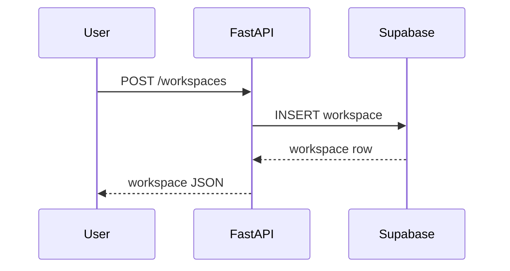

# Implementation logs (`docs/implement/*`)

Mục tiêu của thư mục `docs/implement`:
- Ghi lại từng lần triển khai feature / bugfix một cách ngắn gọn, có cấu trúc.
- Giúp bạn (và các agent khác) nhanh chóng hiểu:
  - Đã làm gì trong lần code trước.
  - Đã chạm vào file nào.
  - API request/response đang kỳ vọng là gì.
  - Flow chính đang hoạt động theo sequence / diagram nào.

Khi **hoàn thành một task coding có ý nghĩa** (feature mới, refactor lớn, sửa bug quan trọng), agent phải:
- Tạo **một file mới** trong thư mục này:
  - Tên file: `implement-<short-feature-name>.md`
  - Khuyến nghị: thêm ngày cho dễ tracking, ví dụ:
    - `implement-2025-01-10-workspace-crud.md`
    - `implement-2025-01-10-upload-documents-api.md`
- Viết nội dung theo template dưới đây (có thể lược bớt nếu task rất nhỏ, nhưng **không được bỏ qua hoàn toàn**).

---

## 1. Quy tắc đặt tên file

- Prefix cố định: `implement-`.
- Phần còn lại dùng **kebab-case tiếng Anh**, ví dụ:
  - `implement-2025-01-10-phase-1-db-and-config.md`
  - `implement-2025-02-03-chat-endpoint-basic.md`
- Một feature lớn có thể chia nhiều file (theo phase nhỏ), nhưng mỗi lần chạy agent nên ưu tiên **gắn tiếp vào file hiện có** nếu cùng feature, thay vì tạo file mới.

---

## 2. Template đề xuất cho mỗi file implement

Copy template này khi tạo file mới, rồi điền nội dung tương ứng:

```markdown
# Implement: <Feature Name>

## 1. Summary
- Mục tiêu: mô tả rất ngắn feature / fix này giải quyết vấn đề gì.
- Scope: server/client/both, phase nào (Phase 1/2/3...).

## 2. Related spec / design
- Requirements:
  - `docs/requirements/requirements-phase-X.md` – mục liên quan (nếu có)
- Design:
  - `docs/design/phase-X-design.md` – section liên quan (nếu có)

## 3. Files touched
- `server/app/...` – mô tả 1 dòng thay đổi chính
- `server/app/...` – ...
- `client/...` – nếu có

## 4. API changes (nếu có)

### 4.1 Endpoints
- `POST /workspaces` – tạo workspace mới
- `GET /workspaces/{workspace_id}` – lấy chi tiết workspace

### 4.2 Request example
```http
POST /api/workspaces HTTP/1.1
Authorization: Bearer <token>
Content-Type: application/json

{
  "name": "Luật VN - 2020",
  "description": "Workspace luật VN 2020 lần 1"
}
```

### 4.3 Response example
```json
{
  "id": "uuid",
  "name": "Luật VN - 2020",
  "description": "Workspace luật VN 2020 lần 1",
  "created_at": "2025-01-10T12:00:00Z"
}
```

## 5. Sequence / flow

> Vẽ sequence diagram hoặc flow chính để các lần sau dễ hình dung.

- Có thể dùng **Mermaid**:



- Hoặc ASCII nếu thích:

```text
User -> API -> DB -> API -> User
```

## 6. Notes / TODO
- Ghi chú các điểm còn thiếu, assumption, hoặc việc cần làm ở phase sau.
- Ví dụ:
  - [ ] Chưa thêm pagination cho danh sách workspace.
  - [ ] Chưa handle soft-delete.
```

Agent có thể bỏ bớt phần không liên quan (ví dụ không có API mới thì chỉ ghi "No API changes"), nhưng **luôn phải có**:
- `Summary`
- `Files touched`
- `Notes / TODO` (dù chỉ là “None”).

