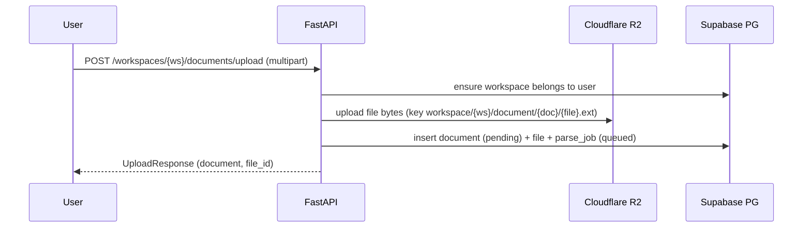

# Implement: Phase 1 API & DB Skeleton

## 1. Summary
- Scope: server, Phase 1.
- Built async SQLAlchemy Core repositories and wired FastAPI routes for workspaces, documents upload, conversations, messages; added R2 upload skeleton and mock AI reply.
- Normalized DB DSN to asyncpg for uvicorn startup without psycopg2.

## 2. Related spec / design
- Requirements: `docs/requirements/requirements-phase-1.md`
- Design: `docs/design/phase-1-design.md`
- Architecture: `docs/design/architecture-overview.md`

## 3. Files touched
- `server/app/db/repositories.py` – Implemented async CRUD for workspaces, documents, files, parse_jobs, conversations, messages (with UUID generation).
- `server/app/db/session.py` – Normalize Postgres DSN to asyncpg before creating engine.
- `server/app/api/routes/workspaces.py` – CRUD wiring using repos and auth.
- `server/app/api/routes/documents.py` – Upload flow: checksum, R2 upload, create document/file/parse_job, list documents.
- `server/app/api/routes/conversations.py` – Create/list conversations with workspace ownership check.
- `server/app/api/routes/messages.py` – List/create messages, add mock AI reply placeholder.
- `server/app/core/config.py` – Ensure sub-settings load `.env`.
- `pyproject.toml` – Added python-dotenv for `.env` loading.
- `poetry.lock` – Synced deps.

## 4. API changes
- `POST /api/workspaces` – Create workspace for current user.
- `GET /api/workspaces` – List workspaces of current user.
- `GET /api/workspaces/{workspace_id}` – Workspace detail (403/404 via ownership check).
- `POST /api/workspaces/{workspace_id}/documents/upload` – Upload multipart files, store to R2, create document/file/parse_job.
- `GET /api/workspaces/{workspace_id}/documents` – List documents in workspace.
- `POST /api/workspaces/{workspace_id}/conversations` – Create conversation.
- `GET /api/workspaces/{workspace_id}/conversations` – List conversations.
- `GET /api/conversations/{conversation_id}/messages` – List messages (ownership enforced).
- `POST /api/conversations/{conversation_id}/messages` – Create user message and mock AI reply.

## 5. Sequence / flow (upload)

## 6. Notes / TODO
- No validation/pagination yet; add later.
- Upload assumes R2 credentials valid; missing retry/error handling.
- Schema constraints (FK/user ownership) depend on Supabase setup; ensure DB schema matches repo columns.
- Mock AI reply should be replaced by RAG in Phase 3.
- `.env` still has placeholder values; fill real Supabase/R2 creds before real runs.
