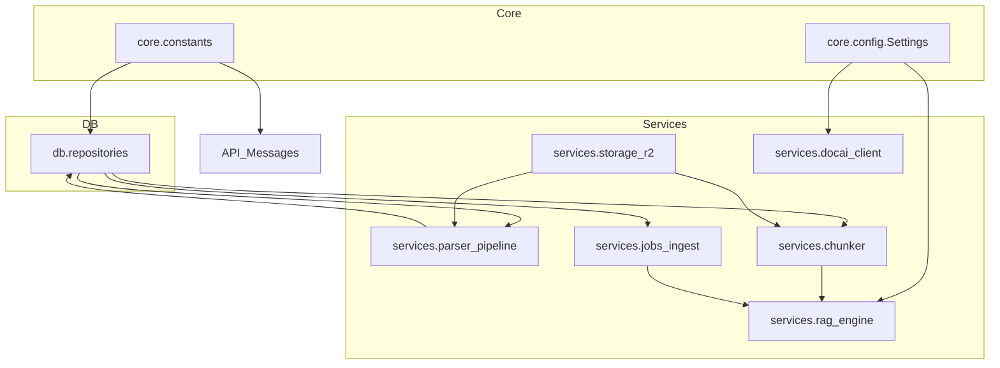

# Implement: Init architecture for Phase 2/3 services and shared constants

## 1. Summary
- Scope: server, Phase 1–3 scaffolding.
- Added shared constants for roles/statuses, extended config for Document AI and RAG, and scaffolded Phase 2/3 service modules (Document AI client, parser pipeline, chunker, RAG engine, ingest jobs) without enabling runtime behavior yet.

## 2. Related spec / design
- Requirements Phase 1: `docs/requirements/requirements-phase-1.md`
- Requirements Phase 2: `docs/requirements/requirements-phase-2.md`
- Requirements Phase 3: `docs/requirements/requirements-phase-3.md`
- Architecture: `docs/design/architecture-overview.md`
- Phase 1 design: `docs/design/phase-1-design.md`
- Phase 2 design: `docs/design/phase-2-design.md`
- Phase 3 design: `docs/design/phase-3-design.md`

## 3. Files touched
- `server/app/core/constants.py` – New module holding role and status constants (user/ai roles, document and parse_job statuses, parser type).
- `server/app/core/config.py` – Added `DocumentAISettings` and `RagSettings` sections and exposed them via `Settings` for future Phase 2/3 usage.
- `server/app/db/repositories.py` – Switched hard-coded document and parse job status strings to use constants.
- `server/app/api/routes/messages.py` – Switched message role literals to use shared role constants.
- `server/app/services/docai_client.py` – New Document AI client wrapper with async interface stub for OCR calls.
- `server/app/services/parser_pipeline.py` – New parser pipeline service skeleton with methods for single-job and batch processing.
- `server/app/services/chunker.py` – New chunker service skeleton for building RAG-Anything `content_list` from documents.
- `server/app/services/rag_engine.py` – New RAG engine adapter skeleton managing per-workspace RAG instances and defining ingest/query/delete interfaces.
- `server/app/services/jobs_ingest.py` – New ingest job service skeleton orchestrating parsed documents into RAG and updating DB (to be implemented in Phase 3).
- `docs/implement/implement-2025-12-01-init-architecture-phase-2-3-and-constants.md` – This implementation log.

## 4. API changes
- No externally visible API contract changes in this task.
- Internally, message role handling now uses `ROLE_USER`/`ROLE_AI` constants instead of literals, but the observable behavior remains identical.

## 5. Sequence / flow

### 5.1. High-level service layering after this change

## 6. Notes / TODO
- Document AI and RAG engine integrations are deliberately left unimplemented (`NotImplementedError`) to avoid introducing hard external dependencies before credentials and libraries are ready.
- Parser and ingest job services only define interfaces; future Phase 2/3 tasks should:
  - Add repository helpers for selecting parse_jobs and parsed documents.
  - Implement `ParserPipelineService.process_single_job` and `fetch_and_process_next_jobs` per `phase-2-design.md`.
  - Implement `ChunkerService.build_content_list_from_document` and `IngestJobService` per `phase-3-design.md`.
  - Wire worker loops in `parse_worker.py` and `ingest_worker.py` to use these services.
- When Document AI and RAG are implemented, revisit constants to add any new statuses (e.g., ingest failures) and update this log with deviations from the original design if necessary.

## 7. Update 2025-12-13 – Architecture doc aligned to LightRAG
- Updated `docs/design/architecture-overview.md` to describe the RAG engine layer as LightRAG-based instead of RAG-Anything, and clarified that the current server runtime no longer imports `raganything`.
- Kept the overall layering (API, DB, storage, parser, RAG engine, workers, client) unchanged; this is a documentation-only alignment with the Phase 9 implementation where `rag_engine.py` wraps LightRAG directly.
