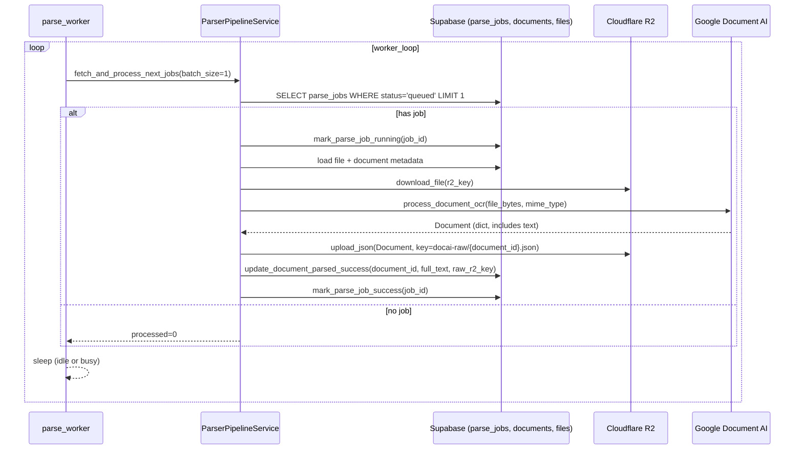

# Implement: Phase 2 – Document AI OCR & parser pipeline

## 1. Summary
- Scope: server, Phase 2.
- Implemented Cloudflare R2 helpers for download/JSON, a Document AI client wrapper, repository helpers for parse_jobs/documents, the parser pipeline service, a long-running parse worker, and an API endpoint to inspect parse status per document.

## 2. Related spec / design
- Requirements Phase 2: `docs/requirements/requirements-phase-2.md`
- Architecture overview: `docs/design/architecture-overview.md`
- Phase 2 design: `docs/design/phase-2-design.md`
- Research: `docs/research/research-documentai-r2-parser-pipeline.md`

## 3. Files touched
- `server/app/services/storage_r2.py` – Added `download_file`, `upload_json`, `download_json` using a shared boto3 client with basic retry config and `run_in_threadpool` for async safety.
- `server/app/services/docai_client.py` – Implemented `DocumentAIClient` using `google-cloud-documentai` v1, wrapping `process_document` into an async-friendly API and returning the `Document` as a dict.
- `server/app/db/repositories.py` – Added helpers for parse_jobs and documents: fetch queued jobs, get job by id, mark running/success/failed, update document parsed/error, and fetch latest parse_job for a document; wired to constants.
- `server/app/services/parser_pipeline.py` – Implemented `ParserPipelineService` to pull file metadata, download from R2, call Document AI, store `docai_full_text` and JSON raw key, and update job/document statuses with logging.
- `server/app/workers/parse_worker.py` – Replaced placeholder with an async loop that repeatedly calls `ParserPipelineService.fetch_and_process_next_jobs` and sleeps between iterations.
- `server/app/schemas/documents.py` – Extended schemas with `ParseJobInfo` and `DocumentDetail` for exposing parse status and job metadata.
- `server/app/api/routes/documents.py` – Added `GET /api/workspaces/{workspace_id}/documents/{document_id}` to return document info plus latest parse_job, using the new repository helpers and schemas.

## 4. API changes
- New endpoint:
  - `GET /api/workspaces/{workspace_id}/documents/{document_id}`  
    - Response: `DocumentDetail`:
      - `document`: basic document fields (id, title, status, created_at, updated_at).
      - `parse_job`: optional `ParseJobInfo` (id, status, error_message, started_at, finished_at) for the latest job of that document.

## 5. Sequence / flow

### 5.1. Worker loop and parser pipeline

## 6. Notes / TODO
- `DocumentAIClient` currently assumes Application Default Credentials and required envs (`GCP_PROJECT_ID`, `GCP_LOCATION`, `DOCAI_OCR_PROCESSOR_ID`) are set; if not, it raises a runtime error at worker startup. We may later want a clearer startup check or feature flag for environments without Document AI.
- Parser pipeline now uses a simple heuristic: any exception during processing marks the job as `failed` and the document status as `error`. A future iteration could distinguish retriable vs permanent errors and allow requeueing without flipping document status.
- The SQL used to join `files` and `documents` is minimal; if documents can have multiple files later, we may need to refine selection or support multi-file parse strategies.
- No unit tests were added in this change; once libraries are installed and DB schema is stable, adding tests around `ParserPipelineService` and the new API endpoint would be valuable. 

