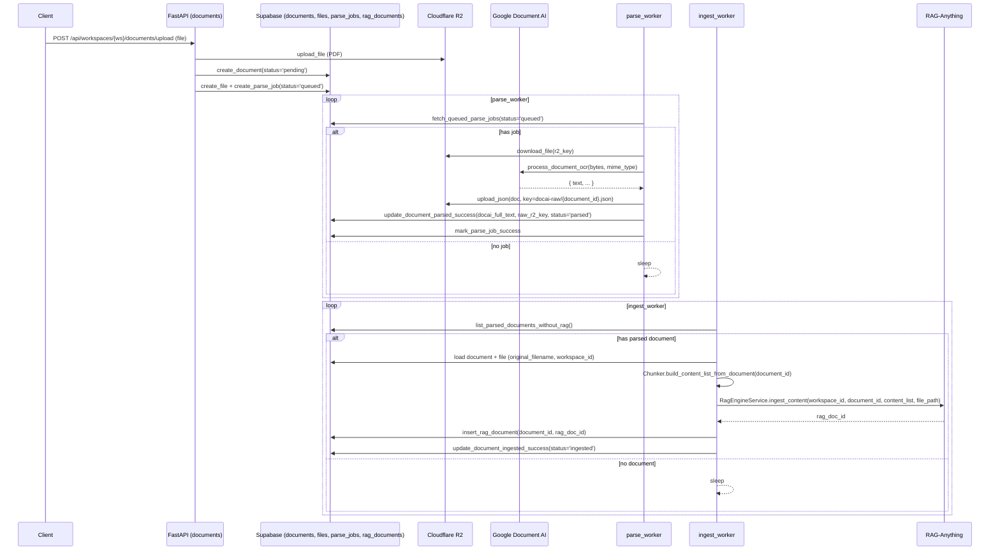
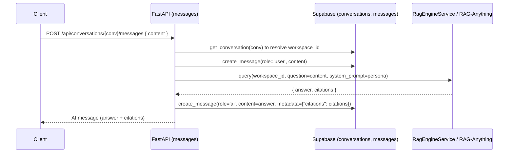

# Implement: Phase 3 – RAG Engine Integration (RAG-Anything)

## 1. Summary
- Scope: server, Phase 3.
- Implemented the RAG engine adapter on top of RAG-Anything, chunking from OCR text into `content_list`, a background ingestion worker that feeds parsed documents into RAG per workspace, chat integration that uses RAG to answer questions with citations, and basic document delete behavior that cleans up DB mappings.

## 2. Related spec / design
- Requirements Phase 3: `docs/requirements/requirements-phase-3.md`
- Architecture overview: `docs/design/architecture-overview.md`
- Phase 3 design: `docs/design/phase-3-design.md`
- RAG-Anything reference: `RAG-Anything/README.md`

## 3. Files touched
- `server/app/core/config.py` – Extended `RagSettings` with `llm_model` and `embedding_model` fields to configure underlying RAG-Anything models via env.
- `server/app/core/constants.py` – Added `RAG_DEFAULT_SYSTEM_PROMPT` describing the chat persona (tiếng Việt, “mình/bạn”, ưu tiên kiến thức trong workspace, nêu rõ khi không chắc).
- `server/app/services/rag_engine.py` – Implemented `RagEngineService`:
  - Lazily initializes one `RAGAnything` instance per workspace with its own `working_dir`.
  - Wraps `insert_content_list` to ingest `content_list` per document, returning a `rag_doc_id`.
  - Wraps `aquery` to answer a question with a combined system prompt and best-effort `{answer, citations}` JSON parsing.
  - Currently treats `delete_document` as a logical no-op, logging a warning.
- `server/app/services/chunker.py` – Implemented `ChunkerService.build_content_list_from_document`:
  - Loads `documents` and `files` metadata.
  - Uses `docai_full_text` from Document AI and chunks it into ~1500-character text blocks, preferring paragraph boundaries (`\n\n`) when present.
  - Produces a `content_list` of items `{"type": "text", "text": chunk, "page_idx": 0}`.
- `server/app/db/repositories.py` – Added ingestion helpers:
  - `list_parsed_documents_without_rag` to find `documents.status='parsed'` without `rag_documents`.
  - `insert_rag_document` to create `rag_documents` mapping rows.
  - `update_document_ingested_success` to set `documents.status='ingested'`.
  - `delete_rag_document_mapping` to remove `rag_documents` rows for a document.
- `server/app/services/jobs_ingest.py` – Implemented `IngestJobService`:
  - `ingest_document(document_id)` loads metadata, builds `content_list`, calls `RagEngineService.ingest_content`, inserts `rag_documents` mapping, and marks the document as `ingested`.
  - `ingest_pending_documents(batch_size)` finds parsed documents without mapping and ingests them in batches.
- `server/app/workers/ingest_worker.py` – Implemented ingest worker loop:
  - Instantiates `RagEngineService`, `ChunkerService`, and `IngestJobService`.
  - Periodically processes pending documents (`status='parsed'` & no `rag_documents`) and sleeps between iterations.
- `server/app/api/routes/messages.py` – Wired chat API to RAG:
  - On `POST /api/conversations/{conversation_id}/messages`, now:
    - Saves user message.
    - Loads conversation to get `workspace_id`.
    - Calls `RagEngineService.query` with the question and default persona.
    - Saves AI message with `content=answer` and `metadata={"citations": [...]}` (if any).
- `server/app/api/routes/documents.py` – Added `DELETE /api/workspaces/{workspace_id}/documents/{document_id}`:
  - Auth + workspace and document existence checks.
  - Removes `rag_documents` mapping, calls `RagEngineService.delete_document` (currently no-op), then deletes the document row.
- `README.md` – Documented the Phase 3 ingest worker and the full pipeline from upload → parse → ingest → chat.

## 4. API changes
- Chat messages:
  - `POST /api/conversations/{conversation_id}/messages`:
    - Behavior changed from mock response to real RAG-backed reply.
    - Response is still a `Message`, but the AI message now contains:
      - `content`: answer generated via RAG-Anything.
      - `metadata`: `{"citations": [...]}`
        - `citations` is a best-effort list of dicts produced by the RAG system; the schema is intentionally loose for v1.
- Documents:
  - New endpoint: `DELETE /api/workspaces/{workspace_id}/documents/{document_id}`:
    - Deletes the document row after removing any `rag_documents` mapping and calling `RagEngineService.delete_document`.
    - Files in R2 are currently left untouched (can be revisited in a later phase).

## 5. Sequence / flow

### 5.1. Upload → Parse → Ingest

### 5.2. Chat with RAG

## 6. Notes / TODO
- `RagEngineService`:
  - Currently assumes usage of OpenAI-compatible APIs via `OPENAI_API_KEY` and optional `OPENAI_BASE_URL`, using model names from `RagSettings.llm_model` and `RagSettings.embedding_model`.
  - `query` method uses a soft JSON contract (`{"answer": "...", "citations": [...]}`) via system prompt; in practice the model may still return plain text. Backend handles both cases.
  - `delete_document` is intentionally a no-op; physical cleanup of RAG storages (per workspace) should be revisited once LightRAG/RAG-Anything exposes a stable delete API.
- `ChunkerService`:
  - V1 uses `page_idx = 0` for all chunks; future improvements can use Document AI JSON to map text back to actual pages.
  - Chunk size is in characters, not tokens; if needed we can refine to be token-aware.
- Ingestion error handling:
  - If ingest fails, the document remains `status='parsed'` and has no `rag_documents` row, allowing manual or automatic retries later.
  - No separate `ingest_failed` status is introduced yet to keep the schema minimal.
- Deletion:
  - The delete endpoint currently removes DB mapping and document row only. Cleaning R2 blobs and RAG storages can be added in a future phase once requirements are clarified.
