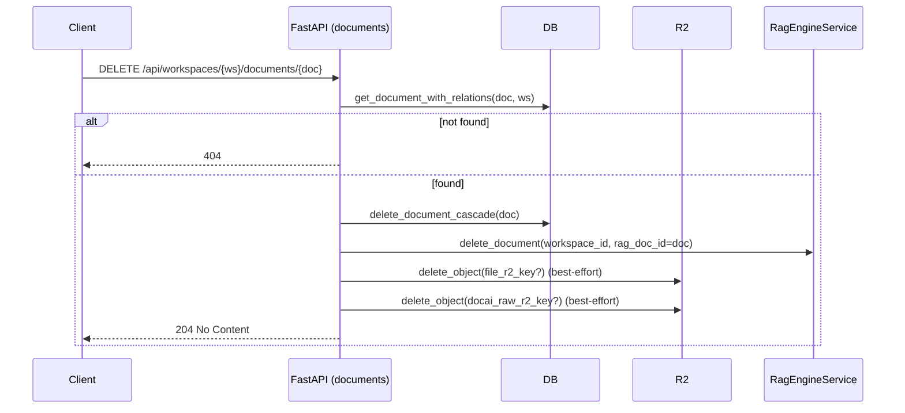
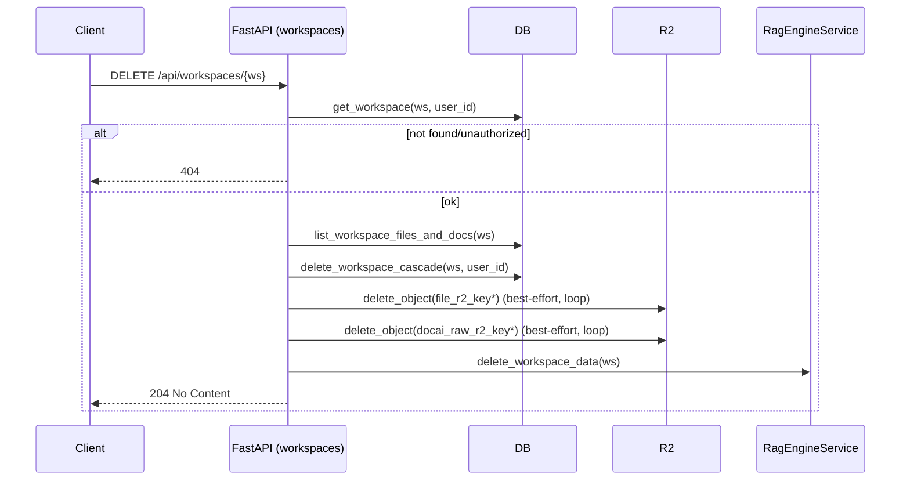

# Implement: Phase 4 – Delete & Cleanup (Workspace / Conversation / Document / RAG / R2)

## 1. Summary
- Scope: server, Phase 4.
- Implemented full delete flows for workspaces, conversations, documents, and (optionally) messages, including:
  - Cascade deletes in Postgres for related rows.
  - Best-effort cleanup of file blobs and OCR JSON on Cloudflare R2.
  - Best-effort cleanup of per-workspace RAG storage directories for RAG-Anything.

## 2. Related spec / design
- Requirements Phase 4: `docs/requirements/requirements-phase-4.md`
- Design Phase 4: `docs/design/phase-4-design.md`
- Previous phases:
  - Phase 1: `docs/requirements/requirements-phase-1.md`, `docs/design/phase-1-design.md`
  - Phase 2: `docs/requirements/requirements-phase-2.md`, `docs/design/phase-2-design.md`
  - Phase 3: `docs/requirements/requirements-phase-3.md`, `docs/design/phase-3-design.md`

## 3. Files touched
- `server/app/services/storage_r2.py`
  - Added:
    - `_delete_object_sync(key: str)` – sync helper to delete a single R2 object via S3 client.
    - `async delete_object(key: str)` – async wrapper using `run_in_threadpool`.
- `server/app/services/rag_engine.py`
  - Clarified `delete_document` docstring/logging to reflect logical delete semantics in Phase 3/4.
  - Added:
    - `async delete_workspace_data(workspace_id: str)` – best-effort removal of per-workspace RAG directory (`RAG_WORKING_DIR/{workspace_id}`) using `shutil.rmtree(...)`.
- `server/app/db/repositories.py`
  - RAG/document helpers:
    - `get_document_with_relations(session, document_id, workspace_id)` – joins `documents` + `files` to expose `docai_raw_r2_key` and `file_r2_key` for delete flows.
    - `delete_document_cascade(session, document_id)` – deletes `rag_documents`, `parse_jobs`, `files`, and `documents` for a given document_id in a single transaction.
  - Conversation helpers:
    - `delete_conversation_cascade(session, conversation_id)` – deletes all `messages` for a conversation, then the conversation row.
  - Workspace helpers:
    - `list_workspace_files_and_docs(session, workspace_id)` – joins `documents` + `files` and returns:
      - `document_id`, `docai_raw_r2_key`, `file_r2_key` for each row in the workspace.
    - `delete_workspace_cascade(session, workspace_id, user_id)` – ensures workspace belongs to `user_id`, then deletes:
      - `messages` (via conversation subquery),
      - `conversations`,
      - `rag_documents`, `parse_jobs`, `files` (via document subquery),
      - `documents`,
      - `workspaces`.
  - Message helpers (optional DELETE message support):
    - `get_message(session, message_id, conversation_id, user_id)` – fetches a single message ensuring it belongs to the user’s conversation.
    - `delete_message(session, message_id)` – deletes one message row.
- `server/app/api/routes/documents.py`
  - Upgraded `DELETE /api/workspaces/{workspace_id}/documents/{document_id}`:
    - Before: only removed `rag_documents` mapping + document row, left files/R2/RAG largely untouched.
    - Now:
      - Uses `get_document_with_relations` to get `file_r2_key` and `docai_raw_r2_key`.
      - Calls `delete_document_cascade` to remove `rag_documents`, `parse_jobs`, `files`, and `documents` in DB.
      - Calls `RagEngineService.delete_document(workspace_id, rag_doc_id=document_id)` (still logical/no-op).
      - Best-effort deletes `file_r2_key` and `docai_raw_r2_key` via `storage_r2.delete_object`, ignoring errors.
- `server/app/api/routes/conversations.py`
  - Added `DELETE /api/workspaces/{workspace_id}/conversations/{conversation_id}`:
    - Checks workspace ownership via `_ensure_workspace`.
    - Uses `get_conversation` to ensure conversation belongs to the user and the given workspace.
    - Calls `delete_conversation_cascade` to delete all messages and the conversation row.
- `server/app/api/routes/workspaces.py`
  - Added `DELETE /api/workspaces/{workspace_id}`:
    - Verifies workspace belongs to `current_user`.
    - Uses `list_workspace_files_and_docs` to collect:
      - All `files.r2_key` and `documents.docai_raw_r2_key` for the workspace.
    - Calls `delete_workspace_cascade` to delete all DB rows related to the workspace.
    - Best-effort delete for all collected R2 keys using `storage_r2.delete_object`.
    - Calls `RagEngineService.delete_workspace_data(workspace_id)` to remove the workspace’s RAG storage directory.
- `server/app/api/routes/messages.py`
  - Added optional `DELETE /api/conversations/{conversation_id}/messages/{message_id}`:
    - Ensures conversation belongs to the user via `_ensure_conversation`.
    - Uses `get_message` to ensure the message belongs to that conversation and user.
    - Calls `delete_message` to remove the row.

## 4. API changes
- Documents:
  - `DELETE /api/workspaces/{workspace_id}/documents/{document_id}`:
    - Behavior now:
      - Cascades DB deletes across `rag_documents`, `parse_jobs`, `files`, and `documents`.
      - Deletes the original file on R2 and the OCR JSON (`docai-raw/*`) when keys exist.
      - Still calls `RagEngineService.delete_document` as a logical delete hook.
- Conversations:
  - New endpoint:
    - `DELETE /api/workspaces/{workspace_id}/conversations/{conversation_id}`:
      - Deletes all messages in that conversation and the conversation itself.
- Workspaces:
  - New endpoint:
    - `DELETE /api/workspaces/{workspace_id}`:
      - Deletes all DB rows tied to the workspace (messages, conversations, rag_documents, parse_jobs, files, documents, workspace).
      - Removes related blobs in Cloudflare R2 (file + OCR JSON) based on DB keys.
      - Cleans up the per-workspace RAG storage directory.
- Messages (optional behavior):
  - New endpoint:
    - `DELETE /api/conversations/{conversation_id}/messages/{message_id}`:
      - Deletes a single message row if it belongs to the user’s conversation.

## 5. Sequence / flow

### 5.1. Delete document

### 5.2. Delete workspace

## 6. Notes / TODO
- RAG physical delete:
  - `RagEngineService.delete_document` remains a logical hook; vectors/graph data are still present in the workspace’s storage directory until the directory is removed (e.g., on workspace delete).
  - For document-level physical cleanup, we will need LightRAG/RAG-Anything to expose a proper delete API in a future phase.
- R2 delete:
  - All R2 deletions are best-effort; failures are silently ignored at the API layer (to avoid failing the whole DELETE). For real-world ops, adding structured logging or metrics for failed keys would be valuable.
- Concurrency:
  - If workers (parse/ingest) are running while a workspace/document is deleted, some transient errors may be logged, but DB constraints + delete order should prevent inconsistent permanent state.
- Soft delete:
  - Phase 4 keeps hard delete semantics. If audit/logging is needed later, a Phase 5 can introduce soft delete fields (`deleted_at`/`is_deleted`) without breaking these APIs (they can be reinterpreted as “mark deleted”). 

