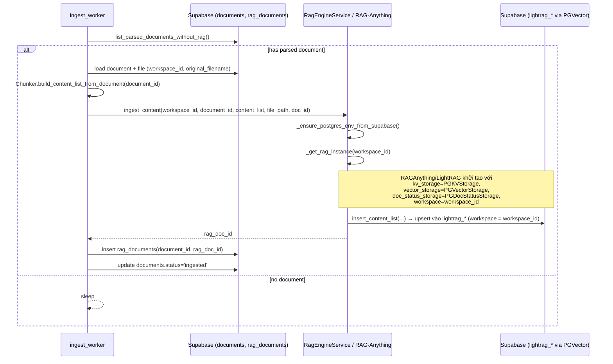
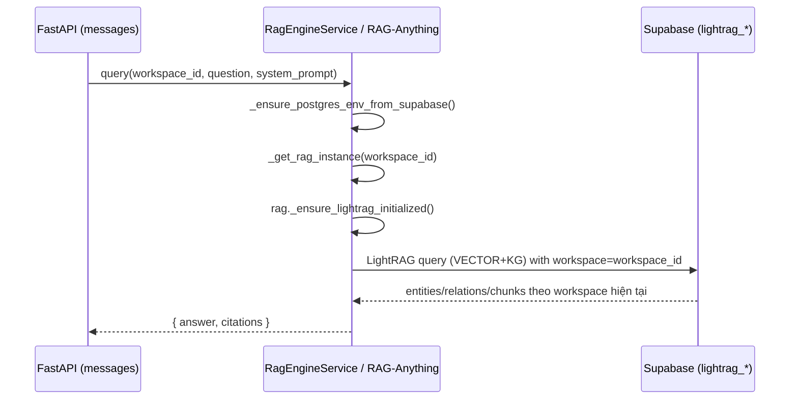

# Implement: Phase 3 – Switch RAG Storage to Supabase PGVector

## 1. Summary
- Scope: server, Phase 3 (RAG Engine storage backend).
- Mục tiêu: chuyển LightRAG/RAG-Anything từ storage local JSON (file-based dưới `rag_workspaces/`) sang sử dụng Supabase Postgres với PGVector (`PGKVStorage`, `PGVectorStorage`, `PGDocStatusStorage`) làm knowledge store chính, đồng thời giữ nguyên API hiện có (`ingest_content`, `query`, delete flows) và isolation theo `workspace_id`.
- Thay đổi này chỉ áp dụng cho **tài liệu ingest mới** từ thời điểm này trở đi; dữ liệu file-based cũ được coi là tạm và nếu cần sử dụng lại với RAG thì phải re-ingest.

## 2. Related spec / design
- Requirements Phase 3: `docs/requirements/requirements-phase-3.md`
- Phase 3 design: `docs/design/phase-3-design.md`
- Architecture overview: `docs/design/architecture-overview.md`
- RAG-Anything / LightRAG storage docs (trong package `lightrag` & `RAG-Anything/env.example`):
  - Storage types: `PGKVStorage`, `PGVectorStorage`, `PGDocStatusStorage`
  - Postgres config: `POSTGRES_HOST/PORT/USER/PASSWORD/DATABASE`, `POSTGRES_SSL_MODE`, `POSTGRES_MAX_CONNECTIONS`

## 3. Files touched
- `server/app/services/rag_engine.py`
  - Thêm helper `_ensure_postgres_env_from_supabase()`:
    - Parse `SUPABASE_DB_URL` (qua `sqlalchemy.engine.url.make_url`) để derive `POSTGRES_HOST`, `POSTGRES_PORT`, `POSTGRES_USER`, `POSTGRES_PASSWORD`, `POSTGRES_DATABASE`.
    - Set `POSTGRES_MAX_CONNECTIONS=10`, `POSTGRES_STATEMENT_CACHE_SIZE=0` và `EMBEDDING_DIM=3072` (nếu chưa được cấu hình), nhằm:
      - Dùng chung cluster Supabase với LightRAG,
      - Tắt prepared statements cache của asyncpg theo khuyến nghị khi đi qua PgBouncer transaction pooler (tránh lỗi `InvalidSQLStatementNameError: prepared statement "__asyncpg_stmt_xx__" does not exist`).
      - Đảm bảo PGVector column `VECTOR(EMBEDDING_DIM)` khớp với dimension thật của model `text-embedding-3-large` (3072), tránh lỗi `expected 1024 dimensions, not 3072`.
    - **Không** tự động set `POSTGRES_SSL_MODE` để tránh xung đột certificate; asyncpg sẽ dùng SSL behavior mặc định (đang hoạt động ổn với Supabase trong app chính).
  - Cập nhật `_get_rag_instance(workspace_id)`:
    - Gọi `_ensure_postgres_env_from_supabase()` trước khi khởi tạo RAG-Anything.
    - Vẫn dùng `RAGAnythingConfig(working_dir=workspace_dir)` với `workspace_dir = os.path.join(settings.working_dir, workspace_id)` để giữ per-workspace working dir.
    - Khi tạo `RAGAnything`, truyền thêm `lightrag_kwargs`:
      - `working_dir=workspace_dir`
      - `workspace=workspace_id` (namespace trong các bảng `lightrag_*`)
      - `kv_storage="PGKVStorage"`, `vector_storage="PGVectorStorage"`, `doc_status_storage="PGDocStatusStorage"`
      - `vector_db_storage_cls_kwargs={"cosine_better_than_threshold": 0.2}`
    - Cập nhật log init để phản ánh việc dùng PGVector storage.
- `.env.example`
  - Bổ sung block Phase 3 – RAG-Anything / LightRAG:
    - `OPENAI_API_KEY` (và optional `OPENAI_BASE_URL`) để gọi OpenAI-compatible LLM/embedding.
  - Bổ sung block LightRAG Postgres / PGVector storage:
    - Giải thích rằng mặc định backend sẽ tự parse `SUPABASE_DB_URL` thành `POSTGRES_*` nếu các biến này chưa được set.
    - Cho phép override bằng cách uncomment và điền:
      - `POSTGRES_HOST`, `POSTGRES_PORT`, `POSTGRES_USER`, `POSTGRES_PASSWORD`, `POSTGRES_DATABASE`
      - `POSTGRES_MAX_CONNECTIONS`, `POSTGRES_SSL_MODE`
    - Ghi chú: không cần set `POSTGRES_WORKSPACE` vì app dùng `workspace_id` làm namespace cho LightRAG.
- `docs/requirements/requirements-phase-3.md`
  - Mục 2.2: làm rõ rằng storage nội bộ RAG-Anything phải nằm trên Supabase Postgres với PGVector, sử dụng LightRAG `PGKVStorage` / `PGVectorStorage` / `PGDocStatusStorage`.
  - Ghi chú về backward-compat:
    - Môi trường dev đã từng chạy file-based: chỉ tài liệu ingest mới sau khi bật PGVector mới lưu lên Supabase; tài liệu cũ muốn dùng với RAG phải re-ingest.
- `docs/design/phase-3-design.md`
  - Mục 1: nhấn mạnh lại Vector DB là Supabase Postgres + PGVector, schema RAG (`lightrag_*`) tách biệt với schema domain.
  - Mục 2.2: thêm subsection **2.2.1. Chọn storage LightRAG: Supabase PGVector**:
    - Storage classes `PGKVStorage`, `PGVectorStorage`, `PGDocStatusStorage`.
    - Cách đọc config từ `POSTGRES_*` env, tự `CREATE EXTENSION IF NOT EXISTS vector`, tự tạo/migrate bảng.
    - Pseudocode cho `lightrag_kwargs` với `vector_db_storage_cls_kwargs`.
  - Mục 2.3 (Isolation theo workspace):
    - Cập nhật mô tả: isolation kép (file system + database).
    - Pseudocode `RagEngineService._get_instance` mới:
      - `workspace_rag_dir = os.path.join(settings.rag_base_dir, workspace_id)`
      - `lightrag_kwargs = { "working_dir": workspace_rag_dir, "workspace": workspace_id, "kv_storage": "PGKVStorage", "vector_storage": "PGVectorStorage", "doc_status_storage": "PGDocStatusStorage", "vector_db_storage_cls_kwargs": { ... } }`
      - `_instances[workspace_id] = RAGAnything(..., lightrag_kwargs=lightrag_kwargs)`.
  - Mục 7: cập nhật phần “không khoá cứng vector DB”:
    - Clarify: production spec chốt Supabase + PGVector, nhưng binding vẫn đi qua `lightrag_kwargs` nên về mặt kỹ thuật có thể đổi backend (Milvus, Qdrant, …) trong tương lai nếu requirements thay đổi.

## 4. Behavior / API impact
- API `POST /api/conversations/{conversation_id}/messages` và ingest worker **không thay đổi signature**:
  - `RagEngineService.ingest_content(...)` và `RagEngineService.query(...)` vẫn được gọi như trước.
  - Client không cần đổi gì.
- Thay đổi chính là **nơi lưu knowledge của RAG**:
  - Trước đây: file JSON local trong `rag_workspaces/{workspace_id}/kv_store_*.json`, `vdb_*.json`, `kv_store_doc_status.json`.
  - Sau khi triển khai:
    - Knowledge mới (documents ingest mới) được lưu vào các bảng `lightrag_*` trong Supabase (vector + kv + doc_status).
    - Cột `workspace` trong các bảng này được set bằng `workspace_id` của app → retrieval luôn filter đúng workspace.
- Old data:
  - Các file JSON hiện có trong `rag_workspaces/` vẫn tồn tại nhưng không còn là source of truth sau khi LightRAG khởi tạo với PGVector.
  - Nếu cần dùng các document ingest trước khi bật PGVector, cần:
    - Đưa `documents.status` về `'parsed'`, xoá mapping trong `rag_documents`, sau đó để ingest worker re-ingest theo pipeline mới.

## 5. Sequence / flow update (tóm tắt khác biệt)

### 5.1. Ingest (phần RAG)

### 5.2. Query

## 6. Notes / TODO
- Supabase:
  - Cần đảm bảo extension `vector` được bật trong database:
    - Có thể bật thủ công bằng `CREATE EXTENSION IF NOT EXISTS vector;` hoặc dựa vào `configure_vector_extension` của LightRAG (sẽ gọi khi init pool, nếu có quyền).
- Connection pool:
  - LightRAG dùng `asyncpg` + các tham số retry riêng; cấu hình `POSTGRES_MAX_CONNECTIONS` nên được set thấp hơn limit của cluster Supabase, và cân nhắc với pool app chính.
- Data cũ:
  - Chưa có tool migrate từ JSON → PGVector; thiết kế cố ý chỉ áp dụng cho ingest mới để giảm độ phức tạp.
  - Nếu sau này xuất hiện nhu cầu migrate, có thể viết 1 script offline đọc `kv_store_*` + `vdb_*.json` và gọi trực tiếp LightRAG/PGVectorStorage để upsert lại.
- Monitoring:
  - Khi deploy, nên:
    - Kiểm tra log của LightRAG (`PGVectorStorage`, `PostgreSQLDB`) để đảm bảo kết nối Supabase thành công.
    - Dùng Supabase SQL xem các bảng `lightrag_*` có dữ liệu theo từng `workspace` như mong đợi.
