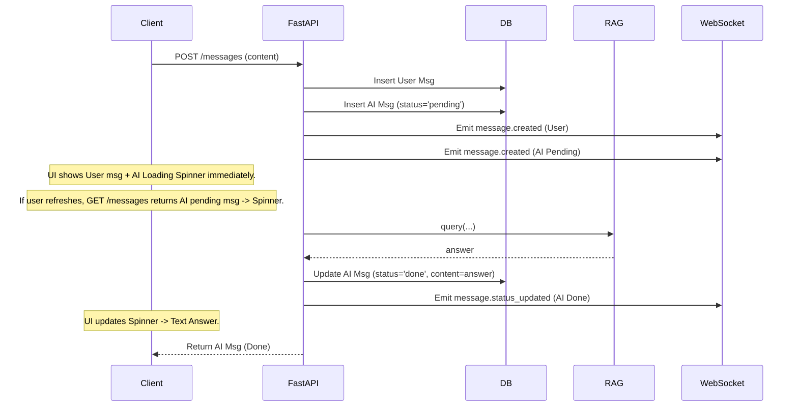

# Implement: Phase 5 – Realtime WebSocket & Worker Reliability

## 1. Summary
- Scope: server (API + workers), Phase 5.
- Mục tiêu: 
  - Thêm WebSocket `/ws` theo user để client có thể nhận realtime event cho chat + document/job status **không cần polling**.
  - Bổ sung cơ chế retry có giới hạn và self-heal cơ bản cho `parse_jobs`.
  - Cải thiện UX chat bằng cách tạo tin nhắn AI ở trạng thái `pending` ngay trên server, đảm bảo F5 hoặc chuyển trang vẫn thấy trạng thái loading.

## 2. Related spec / design
- Requirements: `docs/requirements/requirements-phase-5.md`
- Design: `docs/design/phase-5-design.md`

## 3. Files touched
- `server/app/core/security.py`: Thêm `get_current_user_ws` cho WebSocket Auth.
- `server/app/core/realtime.py`: Thêm `ConnectionManager` và `send_event_to_user` (Robust error handling).
- `server/app/api/routes/realtime.py`: WebSocket endpoint `/ws`.
- `server/app/main.py`: Register router `/ws`.
- `server/app/core/constants.py`: Thêm constants status message/job.
- `server/app/db/models.py`: Thêm `retry_count` (parse_jobs), `status` (messages).
- `server/app/db/repositories.py`:
  - `create_message`: Support `status`.
  - `update_message`: New helper.
  - `requeue_parse_job` / `fetch_stale_running_parse_jobs`.
- `server/app/api/routes/messages.py`:
  - Refactor sang flow **Async/Pending**:
    1. Tạo User Msg (Done).
    2. Tạo AI Msg (Pending) + Commit DB.
    3. Gửi WebSocket `message.created` (User & AI Pending).
    4. Gọi RAG (Synchronous wait).
    5. Update AI Msg (Done) + Commit DB.
    6. Gửi WebSocket `message.status_updated` (AI Done).
- `server/app/api/routes/documents.py`: Thêm realtime events cho upload.
- `server/app/services/parser_pipeline.py` & `workers/parse_worker.py`: Logic retry & self-heal & realtime events.

## 4. API changes

### 4.1 HTTP API
- `POST /api/conversations/{id}/messages`:
  - Vẫn giữ interface cũ (input/output).
  - Tuy nhiên, side-effect là đã tạo message AI trong DB ngay lập tức (status pending).
  - Nếu RAG lỗi, message AI sẽ chuyển sang status `error`.

### 4.2 WebSocket API
- Endpoint: `GET /ws?token=<JWT>`
- Events:
  - `message.created`, `message.status_updated`
  - `document.created`, `document.status_updated`
  - `job.status_updated`

## 5. Sequence / flow (Updated Chat)

## 6. Notes / TODO
- **Ingest Worker:** Hiện tại chưa có bảng `ingest_jobs` riêng và logic retry cho ingest. Ingest được trigger ngay sau parse. (TODO Phase sau).
- **Async RAG:** Hiện tại bước gọi RAG vẫn là `await` trong API route (blocking request HTTP cho đến khi xong).
  - Client có thể `fire-and-forget` (không await response) hoặc dùng WebSocket để nhận kết quả nếu request timeout.
  - Phase sau nên chuyển RAG sang Celery/Background Worker hoàn toàn để API trả về ngay lập tức sau bước 3.