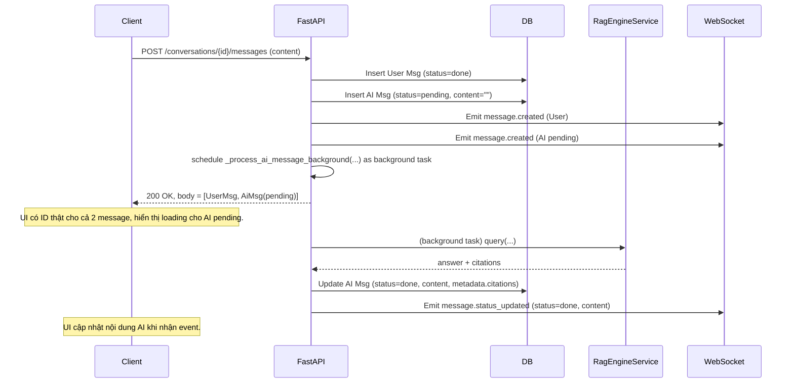

# Implement: Phase 5 – Chat API Background RAG (Non-blocking)

## 1. Summary
- Scope: server (API chat route).
- Goal:
  - Refactor `POST /api/conversations/{id}/messages` từ synchronous (blocking chờ RAG) sang asynchronous (non-blocking) sử dụng background task trong cùng API process.
  - API trả về ngay `UserMessage` + `AiMessage(pending)` để client có ID thật, còn việc gọi RAG và cập nhật message AI được xử lý nền + realtime.

## 2. Related spec / design
- Requirements:
  - `docs/requirements/requirements-phase-5.md` (chat realtime).
- Design:
  - `docs/design/phase-5-design.md` (message status + websocket).
  - Phase 6 (Redis Event Bus) đã sẵn sàng làm hạ tầng realtime, nhưng logic chat non-blocking vẫn thuộc “luồng Phase 5”.

## 3. Files touched
- `server/app/api/routes/messages.py`:
  - Thêm helper background:
    - `_process_ai_message_background(ai_message_id, conversation_id, workspace_id, user_id, question)`:
      - Mở `async_session` mới (không reuse session request).
      - Gọi `RagEngineService.query(...)`.
      - Update AI message trong DB:
        - `status='done'`, `content=answer`, `metadata.citations=...` khi success.
        - `status='error'`, `content="Error generating response: ..."` khi lỗi.
      - Gửi realtime event `message.status_updated` qua WebSocket:
        - `status='done'` + `content` (khi thành công).
        - `status='error'` (khi lỗi).
  - Thay đổi route `create_message`:
    - `response_model` đổi từ `Message` → `MessageListResponse`.
    - Flow:
      1. Validate conversation và quyền (`_ensure_conversation` như cũ).
      2. Tạo User message:
         - `status='done'`.
      3. Tạo AI message placeholder:
         - `status='pending'`, `content=""`.
      4. Emit realtime `message.created` cho:
         - User message (`status='done'`).
         - AI message (`status='pending'`).
      5. Gọi `asyncio.get_event_loop().create_task(_process_ai_message_background(...))`:
         - Không chờ RAG trong HTTP request.
      6. Trả HTTP response ngay:
         - `MessageListResponse(items=[user_msg, ai_msg_pending])`.

## 4. Behaviour / flow (chat)

### 4.1. HTTP + Realtime

### 4.2. Error path

- Nếu RAG query lỗi:
  - Background task:
    - Update AI message: `status='error'`, `content="Error generating response: ..."` (hoặc phiên bản ngắn hơn).
    - Emit `message.status_updated` với `status='error'`.
  - Client:
    - Có thể hiển thị error state dựa trên `status='error'` và/hoặc content.

## 5. API / contract impact

- `POST /api/conversations/{conversation_id}/messages`:
  - **Trước**: trả về `Message` (thường là AI message đã `done`).
  - **Sau**: trả về `MessageListResponse` gồm 2 item:
    - `items[0]`: User message (status=`done`).
    - `items[1]`: AI message placeholder (status=`pending`, content="").
  - Client được khuyến nghị dựa chủ yếu vào WebSocket:
    - `message.created` để append message mới.
    - `message.status_updated` để cập nhật content/status AI.

## 6. Notes / TODO

- Background task hiện tại dùng `asyncio.create_task` trong cùng API process:
  - Đơn giản, không cần thêm worker/queue riêng.
  - Nếu process API bị restart giữa chừng, task đang chạy có thể bị mất – chấp nhận được cho giai đoạn này.
  - Phase sau nếu cần độ bền cao hơn có thể tách sang worker riêng dùng Redis queue.
- Realtime:
  - Tiếp tục sử dụng WebSocket + EventBus (Redis) đã thiết kế ở Phase 5/6.
  - Không thay đổi event type / payload, chỉ thay thời điểm emit `message.status_updated`.

