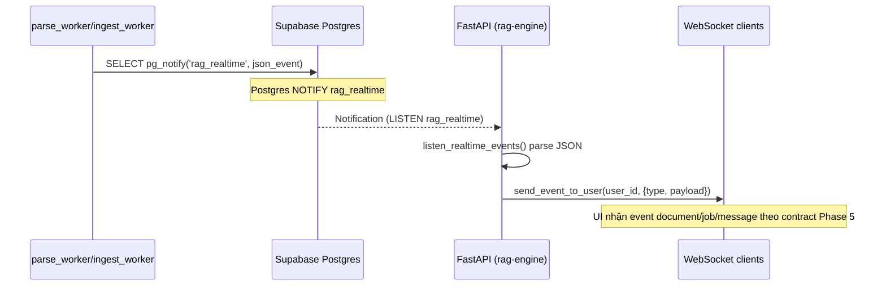
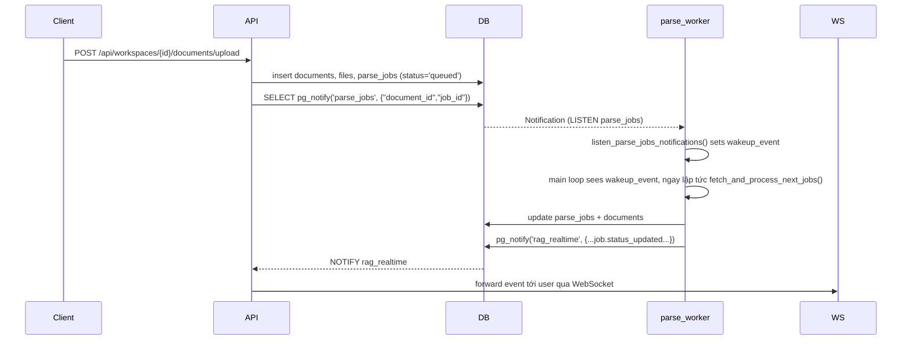

# Implement: Phase 5.1 – Cross-Process Realtime Bridge & Parse Worker Wake-up

## 1. Summary
- Scope: server (API + workers), Phase 5.1.
- Goal:
  - Đảm bảo event realtime từ worker (parse/ingest) đi được tới WebSocket client ngay cả khi worker chạy ở process riêng.
  - Giảm độ trễ giữa lúc tạo `parse_jobs` và lúc `parse_worker` bắt đầu xử lý bằng cơ chế wake-up qua Postgres `LISTEN/NOTIFY`.

## 2. Related spec / design
- Requirements:
  - `docs/requirements/requirements-phase-5.md`
  - `docs/requirements/requirements-phase-5.1.md`
- Design:
  - `docs/design/phase-5-design.md`
  - `docs/design/phase-5.1-design.md`

## 3. Files touched (server)
- `server/app/core/event_bus.py` (Phase 5.1, **đã được thay thế ở Phase 6**):
  - Ban đầu: thêm `EventBus` dùng Postgres `pg_notify` trên channel `rag_realtime`, `listen_realtime_events()` với asyncpg `LISTEN`, và `notify_parse_job_created(...)` dùng `pg_notify('parse_jobs', ...)`.
  - Sau Phase 6: file này đã chuyển sang implementation Redis Event Bus; phần dùng Postgres LISTEN/NOTIFY không còn được sử dụng.
- `server/app/main.py`:
  - Trong sự kiện `startup`, sau khi validate DB + R2, khởi động background task `listen_realtime_events()` để bridge worker → WebSocket.
- `server/app/services/parser_pipeline.py`:
  - Thay vì gọi trực tiếp `send_event_to_user` trong worker, sử dụng `event_bus.publish(...)`:
    - Khi job parse chuyển `running/success/queued/failed`.
    - Khi document chuyển `parsed/error`.
  - Giữ nguyên retry logic và self-heal đã implement ở Phase 5.
- `server/app/services/jobs_ingest.py`:
  - Sau khi ingest thành công và update DB, dùng `event_bus.publish(...)` để gửi `document.status_updated (ingested)`.
- `server/app/api/routes/documents.py`:
  - Sau khi tạo parse_job trong `upload_documents`, gọi:
    - `notify_parse_job_created(document_id, job_id)` để gửi NOTIFY trên channel `parse_jobs`.
  - Vẫn gửi realtime trực tiếp (`send_event_to_user`) cho `document.created` và `job.status_updated (queued)` từ API process.
- `server/app/workers/parse_worker.py`:
  - Thêm `listen_parse_jobs_notifications(wakeup_event)`:
    - Dùng asyncpg `LISTEN parse_jobs`.
    - Callback chỉ set `wakeup_event` (không xử lý DB trực tiếp) để tránh race condition.
  - Trong `run_worker_loop`:
    - Tạo `wakeup_event = asyncio.Event()` và `asyncio.create_task(listen_parse_jobs_notifications(wakeup_event))`.
    - Vòng lặp chính:
      - Gọi `pipeline.fetch_and_process_next_jobs(batch_size=1)` như cũ.
      - Nếu `processed == 0`, `await asyncio.wait_for(wakeup_event.wait(), timeout=idle_sleep_seconds)`:
        - Nếu có NOTIFY trước timeout → worker xử lý job ngay.
        - Nếu timeout → tiếp tục poll như cũ.

## 4. Behaviour / flow

### 4.1. Bridge worker → WebSocket (rag_realtime)

### 4.2. Wake-up parse_worker khi tạo parse_job

## 5. API / contract impact
- HTTP API:
  - Không thay đổi route hay schema mới; hành vi upload/parse/ingest giữ nguyên từ góc nhìn REST.
- WebSocket API:
  - Contract event giữ nguyên như Phase 5:
    - `document.created`, `document.status_updated`
    - `job.status_updated`
    - `message.created`, `message.status_updated`
  - Khác biệt chính:
    - Event do worker emit giờ sẽ đi qua Postgres và tới được WebSocket client (trước đây bị “kẹt” trong process worker).

## 6. Notes / TODO
- LISTEN/NOTIFY là best-effort:
  - Nếu API process tắt hoặc không listen:
    - Notification bị mất, nhưng DB vẫn là source-of-truth; client có thể sync lại qua REST.
  - Nếu parse_worker tắt:
    - Không nhận được NOTIFY, nhưng khi worker start lại vẫn chạy polling và self-heal như Phase 5.
- Performance:
  - Khối lượng event parse/ingest hiện tại thấp, `pg_notify` + 1 listener là đủ.
  - Nếu về sau scale nhiều instance API, có thể cần cơ chế fan-out giữa các instance (ngoài phạm vi Phase 5.1).
- Future work:
  - Có thể trích xuất logic wake-up ingest_worker riêng nếu sau này có `ingest_jobs` table và retry model giống parse_worker.
