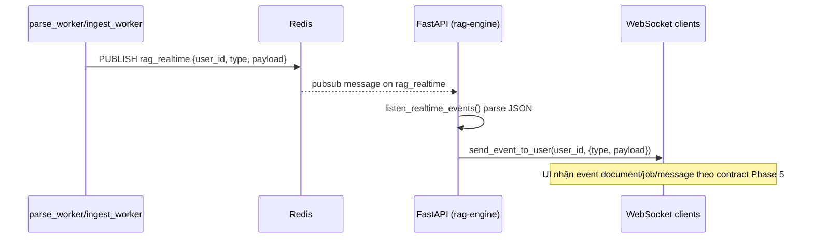
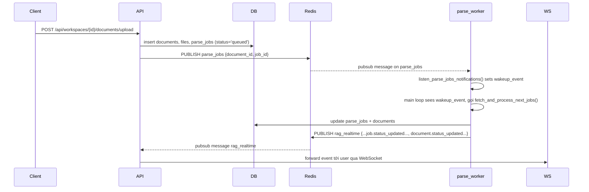

# Implement: Phase 6 – Redis Event Bus & Worker Wake-up

## 1. Summary
- Scope: server (API + workers), Phase 6.
- Goal:
  - Thay thế Event Bus cross-process dựa trên Postgres LISTEN/NOTIFY bằng Redis để tránh hạn chế hạ tầng Supabase (Transaction/Session Pooler + IPv4).
  - Giữ nguyên WebSocket contract (Phase 5), nhưng đảm bảo event từ worker (parse/ingest) tới được WebSocket client ổn định.
  - Dùng Redis để wake-up `parse_worker` gần như tức thì khi có `parse_job` mới, với polling DB làm fallback.

## 2. Related spec / design
- Requirements:
  - `docs/requirements/requirements-phase-5.md`
  - `docs/requirements/requirements-phase-5.1.md`
  - `docs/requirements/requirements-phase-6.md`
- Design:
  - `docs/design/phase-5-design.md`
  - `docs/design/phase-5.1-design.md`
  - `docs/design/phase-6-design.md`

## 3. Files touched (server)
- `server/app/core/config.py`:
  - Thêm `RedisSettings` với env `REDIS_URL` (mặc định `redis://localhost:6379/0`).
  - Thêm field `redis: RedisSettings` vào `Settings`.
- `server/app/core/redis_client.py` (mới):
  - Hàm `get_redis()` trả về client `redis.asyncio.Redis` dùng chung cho mỗi process.
- `server/app/core/event_bus.py`:
  - Thay implementation EventBus từ Postgres `pg_notify` sang Redis:
    - `EventBus.publish(user_id, event_type, payload)` → `redis.publish('rag_realtime', json_envelope)`.
  - `listen_realtime_events()`:
    - Dùng Redis `pubsub.subscribe('rag_realtime')`;
    - `async for message in pubsub.listen()` → parse JSON → `send_event_to_user(user_id, type, payload)` qua WebSocket.
  - `notify_parse_job_created(document_id, job_id)`:
    - Dùng `redis.publish('parse_jobs', {"document_id","job_id"})` để wake-up `parse_worker`.
- `server/app/main.py`:
  - Vẫn gọi `asyncio.create_task(listen_realtime_events())` trong startup; giờ task này là Redis listener (không còn asyncpg LISTEN).
- `server/app/workers/parse_worker.py`:
  - Thay `listen_parse_jobs_notifications` từ asyncpg LISTEN Postgres sang Redis:
    - Dùng `redis.pubsub().subscribe('parse_jobs')`;
    - Khi nhận message `"type": "message"` → `wakeup_event.set()`.
  - Vòng loop chính giữ retry/self-heal; idle dùng `wait_for(wakeup_event, timeout=idle_sleep_seconds)` với fallback polling.
- `server/app/services/parser_pipeline.py` & `server/app/services/jobs_ingest.py`:
  - Không đổi signature `event_bus.publish`, nhưng giờ publish đi Redis thay vì Postgres.
- `server/app/api/routes/documents.py`:
  - Vẫn gọi `notify_parse_job_created(document_id, job_id)` sau khi tạo parse_job, nhưng giờ chức năng là publish wake-up lên Redis.

## 4. Behaviour / flow (Redis)

### 4.1. Bridge worker → WebSocket

### 4.2. Wake-up parse_worker khi tạo parse_job

## 5. API / contract impact

- HTTP API:
  - Không thay đổi route hay schema; upload/parse/ingest vẫn đúng behaviour như trước.
- WebSocket API:
  - Contract event giữ nguyên như Phase 5:
    - `document.created`, `document.status_updated`
    - `job.status_updated`
    - `message.created`, `message.status_updated`
  - Khác biệt chính:
    - Event do worker emit giờ đi qua Redis thay vì Postgres LISTEN/NOTIFY; client không cần biết mà vẫn nhận đủ event.

## 6. Notes / TODO

- Redis là best-effort event bus:
  - Nếu Redis down hoặc `REDIS_URL` sai:
    - Publish/subscribe sẽ log warning và retry (không crash API/worker).
    - parse_worker vẫn có polling fallback (idle_sleep_seconds).
    - Client có thể sync state qua REST nếu mất một số realtime event.
- Phase 5.1:
  - Implementation LISTEN/NOTIFY Postgres vẫn được giữ lại trong log Phase 5.1 để tracking lịch sử, nhưng code runtime đã chuyển sang Redis.
- Env & setup:
  - Cần có Redis chạy (local docker hoặc managed).
  - `REDIS_URL` trong `.env` phải trỏ tới instance này.

