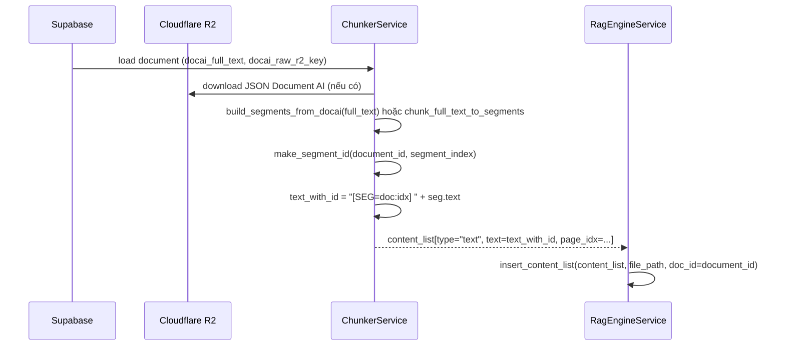
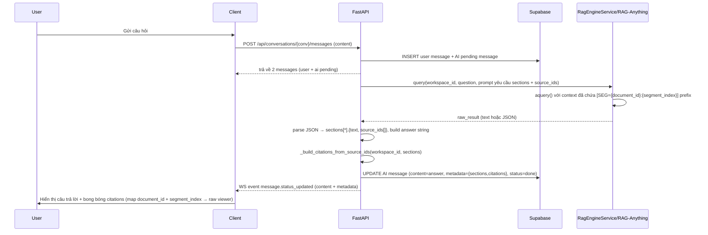

# Implement: Phase 7.2 – ID-Based Citations (NotebookLM-style)

## 1. Summary
- Mục tiêu: đưa Explainable RAG từ mức “đoán nguồn bằng text-matching” (Phase 7/7.1) lên mức “theo dấu ID nguồn”, giống cách NotebookLM gắn bong bóng trích dẫn vào đúng đoạn text thô.
- Cốt lõi thay đổi:
  - Mỗi segment text thô (được build từ Document AI JSON) có một ID ổn định `"{document_id}:{segment_index}"`.
  - ID này được embed vào `content_list` khi ingest vào RAG-Anything (`[SEG={document_id}:{segment_index}] ...`).
  - Prompt RAG yêu cầu LLM trả JSON sections kèm `source_ids[]` (liệt kê các ID đã dùng).
  - Messages API map `source_ids` → citations `{document_id, segment_index, page_idx, snippet_preview}`; text-matching Phase 7.1 chỉ còn là fallback.

## 2. Related spec / design
- Requirements:
  - `docs/requirements/requirements-phase-7.md`
- Design:
  - `docs/design/phase-7-design.md`
  - `docs/design/phase-7.1-design.md`
  - `docs/design/phase-7.2-design.md`
- Architecture:
  - `docs/design/architecture-overview.md`

## 3. Files touched
- `server/app/services/chunker.py`
  - Thêm helper:
    - `make_segment_id(document_id: str, segment_index: int) -> str` để tạo ID ổn định cho mỗi segment (`"{document_id}:{segment_index}"`).
  - `ChunkerService.build_content_list_from_document`:
    - Trước: build `content_list` với `text = seg["text"]`, `page_idx = seg["page_idx"]`.
    - Nay (design ban đầu):
      - Vẫn ưu tiên build `segments` từ Document AI JSON (`build_segments_from_docai`) hoặc fallback `chunk_full_text_to_segments`. (**deprecated – runtime now passes full `docai_full_text` to LightRAG and no longer builds explicit segments**)
      - Với mỗi segment:
        - Tính `segment_index = int(seg["segment_index"])`.
        - `segment_id = make_segment_id(document_id, segment_index)`.
        - `text_with_id = f"[SEG={segment_id}] {seg['text']}"`.
      - Đưa vào `content_list`:
        ```python
        {
          "type": "text",
          "text": text_with_id,
          "page_idx": seg.get("page_idx", 0),
        }
        ```
    - Raw viewer `/raw-text` **không** thêm tag SEG; viewer vẫn nhận `text` thuần từ segments.

- `server/app/services/rag_engine.py`
  - `RagEngineService.query`:
    - Prompt (`effective_system_prompt`):
      - Bổ sung giải thích về tag ID trong context:
        - Ngữ cảnh có dạng `[SEG={document_id}:{segment_index}] <nội dung đoạn>`.
        - Yêu cầu LLM giữ lại thông tin SEG khi trả nguồn.
      - Thay đổi schema JSON mong muốn:
        ```json
        {
          "sections": [
            {
              "text": "<đoạn trả lời 1>",
              "source_ids": ["{document_id}:{segment_index}", "..."]
            },
            ...
          ]
        }
        ```
        - Mỗi `source_id` phải đến từ tag `[SEG=...]` trong ngữ cảnh; không được tự bịa ID.
    - Parsing JSON:
      - Trước: chỉ đọc `sections[*].text`.
      - Nay:
        - Với mỗi `sec` trong `parsed["sections"]`:
          - Đọc `text = sec["text"]` (string).
          - Đọc `source_ids = sec.get("source_ids") or []`, lọc `str` không rỗng.
          - Đưa vào `sections.append({"text": text, "source_ids": source_ids_clean})`.
      - `answer` vẫn được build bằng cách join `sections[*].text` với `\n\n`.
    - Return shape:
      - `{"answer": answer, "sections": sections}`, trong đó mỗi section có thể có `source_ids`.

- `server/app/api/routes/messages.py`
  - Import:
    - Thêm `build_segments_from_docai` vào import chunker + `storage_r2`.
  - Giữ lại `_build_citations_for_sections` (text-matching Phase 7.1) làm **fallback**.
  - Thêm helper mới:
    - `_build_citations_from_source_ids(workspace_id, sections) -> (sections_with_citations, citations_flat)`:
      - Duyệt tất cả sections, gom `source_ids` (nếu có) từ mỗi section.
      - Parse `source_id` theo format `"{document_id}:{segment_index}"`, build tập `(doc_id, segment_index)` duy nhất.
      - Load documents trong workspace có id nằm trong tập này (`status in ('parsed','ingested')`, `docai_full_text` không rỗng).
      - Cho mỗi document:
        - Build `segments`:
          - Nếu có `docai_raw_r2_key`: `build_segments_from_docai(doc, full_text)`.
          - Nếu không: `chunk_full_text_to_segments(full_text)`. (**design-only; runtime no longer uses this helper**)
        - Cho mỗi segment:
          - Nếu `(doc_id, segment_index)` nằm trong tập đã thu thập, đưa vào `segment_lookup[(doc_id, segment_index)] = {document_id, segment_index, page_idx, text}`.
      - Với từng section:
        - Duyệt `source_ids` của section, map từng ID sang segment qua `segment_lookup`.
        - Build citation:
          ```python
          {
            "document_id": seg_info["document_id"],
            "segment_index": seg_info["segment_index"],
            "page_idx": seg_info["page_idx"],
            "snippet_preview": snippet  # text segment cắt ngắn ~200 ký tự
          }
          ```
        - Gắn `citations` vào section + append vào `citations_flat`.
      - Trả về `sections_with_citations` (sections giữ nguyên `text` + `source_ids`, thêm `citations`) và `citations_flat`.
  - `_process_ai_message_background`:
    - Sau khi gọi `rag_engine.query`:
      ```python
      answer = rag_result.get("answer") or ""
      raw_sections = rag_result.get("sections") or []
      ```
    - Thay logic build citations:
      - Kiểm tra xem có section nào có `source_ids` không:
        ```python
        has_source_ids = any(
          isinstance(sec, dict)
          and isinstance(sec.get("source_ids"), list)
          and sec.get("source_ids")
          for sec in raw_sections
        )
        ```
      - Nếu `has_source_ids`:
        - Gọi `_build_citations_from_source_ids(...)`.
      - Ngược lại:
        - Gọi `_build_citations_for_sections(...)` như Phase 7.1 (text-matching) để giữ backward-compat cho document cũ hoặc khi model không tuân thủ JSON.
    - Metadata lưu trên message:
      - `metadata["sections"] = sections_with_citations` (mỗi section chứa `text`, `source_ids` nếu có, và `citations`).
      - `metadata["citations"] = citations_flat` (flatten).
    - Event realtime `message.status_updated` vẫn gửi `metadata` đầy đủ tới client.

## 4. API / behavior changes

### 4.1. Ingest & RAG context

- Document mới ingest (sau khi 7.2 deploy):
  - Nội dung trong LightRAG/RAG-Anything sẽ có prefix `[SEG={document_id}:{segment_index}]` cho mỗi block text.
  - Khi RAG retrieve context, LLM nhìn thấy các tag này trong ngữ cảnh nên có thể trả `source_ids` đúng với ID segment.
- Document cũ (ingest trước 7.2):
  - Không có tag `[SEG=...]` trong context.
  - LLM sẽ không trả được `source_ids` hữu dụng → `has_source_ids = False`.
  - Backend tự động fallback sang text-matching Phase 7.1 để build citations.

### 4.2. Message AI metadata

- Shape tổng thể vẫn giữ như Phase 7/7.1 để không phá client:
  - `metadata.sections[*].text` – câu trả lời từng section.
  - `metadata.sections[*].citations[*]` – citations đã được backend map theo ID.
  - `metadata.citations[*]` – flatten danh sách citations.
- Mới:
  - `metadata.sections[*].source_ids: list[str]` (nếu LLM trả).
    - Ví dụ: `["<document_uuid>:5", "<document_uuid>:6"]`.
  - Client có thể dùng `source_ids` để hiển thị bong bóng kiểu NotebookLM (nhiều nguồn cho một section).

## 5. Sequence / flow (cập nhật Phase 7.2)

### 5.1. Ingest document với segment IDs



### 5.2. Query với ID-based citations



## 6. Notes / TODO

- Độ phụ thuộc vào LLM:
  - ID-based citations phụ thuộc vào việc LLM tuân thủ format JSON và không “bịa” `source_ids`.
  - Backend đã dùng tag `[SEG=...]` + validate ID từ context (chỉ chấp nhận ID có trong ngữ cảnh + có segment mapping được).
  - Khi LLM không tuân thủ, hệ thống tự động fallback sang text-matching Phase 7.1 (ít chính xác hơn nhưng vẫn dùng được).
- Documents cũ:
  - Không có `[SEG=...]` trong RAG storage → không thể dùng ID-based citations.
  - Đối với workspace cần Explainable RAG chính xác, khuyến nghị:
    - Tạo workspace mới, upload lại doc, cho chạy parse + ingest với 7.2.
  - Có thể cân nhắc job re-ingest trong phase sau (xóa dữ liệu RAG và ingest lại từ DB).
- Client:
  - Có thể nâng UI để:
    - Hiển thị nhiều bong bóng citations trên một section (theo `source_ids` / `citations`).
    - Scroll + highlight đúng đoạn text thô theo `document_id + segment_index`, giống NotebookLM.
  - Không bắt buộc đổi schema, nhưng nên cập nhật để tận dụng `source_ids`.
