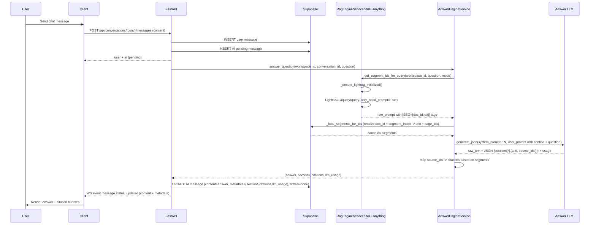

# Implement: Phase 8 – Retrieval-Only RAG & Answer Orchestrator

## 1. Summary

- Scope: server, Phase 8.
- Implemented a new **Answer Orchestrator** pipeline for chat:
  - Uses RAG-Anything / LightRAG **only for retrieval** (no LLM call inside RAG-Anything).
  - Builds its own prompt with context segments (`[SEG={document_id}:{segment_index}] ...`) and calls an OpenAI-compatible LLM via a dedicated `LLMClient`.
  - Parses JSON `{ sections[*].{text, source_ids[]} }` from the LLM and maps `source_ids` → citations `{document_id, segment_index, page_idx, snippet_preview}` using canonical segmentation from Document AI.
- Chat API (`POST /api/conversations/{conversation_id}/messages`) now goes through `AnswerEngineService` instead of `RagEngineService.query`, but the HTTP contract remains unchanged for the client.

## 2. Related spec / design

- Requirements:
  - `docs/requirements/requirements-phase-8.md`
- Design:
  - `docs/design/phase-8-design.md`
- Architecture:
  - `docs/design/architecture-overview.md`
- Earlier phases (for context):
  - Phase 2 – Document AI & OCR: `docs/design/phase-2-design.md`
  - Phase 3 – RAG Engine integration: `docs/design/phase-3-design.md`
  - Phase 7 / 7.1 / 7.2 – Explainable RAG & segments:
    - `docs/design/phase-7-design.md`
    - `docs/design/phase-7.1-design.md`
    - `docs/design/phase-7.2-design.md`

## 3. Files touched

- `server/app/core/config.py`
  - Added `AnswerSettings`:
    - Env prefix: `ANSWER_`.
    - Fields:
      - `model: str = "gpt-4.1-mini"` – default answer model.
      - `base_url: str | None` – optional OpenAI-compatible base URL.
      - `api_key: str | None` – optional dedicated API key (fallback to `OPENAI_API_KEY`).
      - `max_tokens: int = 2048`, `temperature: float = 0.2`.
  - Extended `Settings` with:
    - `answer: AnswerSettings = AnswerSettings()`.

- `server/app/services/llm_client.py` (NEW)
  - Introduced `LLMUsage` (dataclass) and `LLMClient`:
    - Resolves base URL:
      - `ANSWER_BASE_URL` → `OPENAI_BASE_URL` → `https://api.openai.com/v1`.
    - Resolves API key:
      - `ANSWER_API_KEY` → `OPENAI_API_KEY`.
    - Exposes:
      - `async generate_json(system_prompt, user_prompt, json_schema_hint=None) -> (raw_text, parsed_json, usage)`:
        - Uses `requests.post` to call `/chat/completions` with:
          - `model`, `messages`, `temperature`, `max_tokens`.
          - `response_format={"type": "json_object"}` to nudge the model into strict JSON.
        - Extracts:
          - `raw_text` from `choices[0].message.content`.
          - `usage` from `response["usage"]` (prompt/completion/total tokens).
        - Best-effort JSON parsing:
          - Tries full content, then `{...}` substring between first/last braces.
    - Handles missing API key:
      - Logs error and returns a fallback message with `parsed_json=None`, `usage=None`.

- `server/app/services/rag_engine.py`
  - Imports:
    - Added `re` and a global `_SEG_TAG_PATTERN`:
      - Regex: `r"\[SEG=(?P<id>[0-9a-fA-F\-]{36}:\d+)\]"` để bắt các tag SEG.
  - New method:

    ```python
    async def get_segment_ids_for_query(
        self,
        workspace_id: str,
        question: str,
        mode: Optional[str] = None,
    ) -> list[str]:
        ...
    ```

    - Behavior:
      - Lấy `rag = self._get_rag_instance(workspace_id)`.
      - Gọi `rag._ensure_lightrag_initialized()` để đảm bảo LightRAG sẵn sàng.
      - Import `QueryParam` từ `lightrag`.
      - Tạo `QueryParam(mode=query_mode, only_need_prompt=True)`:
        - `only_need_prompt=True` giống cách dùng trong `aquery_vlm_enhanced` của RAG-Anything:
          - LightRAG chỉ build **prompt retrieval** (context + SEG tags), **không** gọi LLM.
      - Gọi `raw_prompt = await rag.lightrag.aquery(question, param=query_param)`.
      - Parse tất cả pattern `[SEG={document_uuid}:{segment_index}]` từ `raw_prompt`:
        - Validate `document_uuid` là UUID, `segment_index` là `int`.
        - Chuẩn hóa thành `"{uuid}:{index}"`.
        - Loại trùng, giữ thứ tự xuất hiện.
      - Trả về `ordered_ids: list[str]` các segment_id (VD: `["957e...c7a:0", "957e...c7a:1"]`).

  - `query(...)` (Phase 7.2) vẫn tồn tại để backward-compat, nhưng không còn được dùng cho chat trong Phase 8; Answer Orchestrator là đường chính.

- `server/app/services/answer_engine.py` (NEW)
  - Tạo `AnswerEngineService` – hộp đen trả lời Phase 8:

    ```python
    class AnswerEngineService:
        async def answer_question(
            self,
            workspace_id: str,
            conversation_id: str,
            question: str,
            max_context_segments: int = 8,
        ) -> dict[str, Any]:
            ...
    ```

  - Khởi tạo:
    - Đọc `AnswerSettings` từ `get_settings().answer`.
    - Tạo `RagEngineService` (ingest + retrieval) và `LLMClient`.
  - Helper `_load_segments_for_ids(workspace_id, segment_ids)`:
    - Input: `segment_ids: list[str]` dạng `"document_uuid:segment_index"` từ `RagEngineService.get_segment_ids_for_query`.
    - Parse & normalize:
      - Bỏ ID invalid, để lại set `(doc_id_str, seg_idx)` duy nhất, giữ thứ tự.
    - DB query:

      ```sql
      SELECT id, docai_full_text, docai_raw_r2_key, status
      FROM documents
      WHERE workspace_id = :workspace_id
        AND docai_full_text IS NOT NULL
        AND id IN (:doc_ids)
      ```

    - Với mỗi document:
      - Lấy `full_text`.
      - (Thiết kế cũ) Nếu có `docai_raw_r2_key` → `download_json` từ R2 → `build_segments_from_docai`. (**deprecated – implementation now always chunks directly from `docai_full_text`**)
      - Nếu không → `chunk_full_text_to_segments`. (**design note only – current runtime lets LightRAG handle chunking from full_text**)
      - Build map `(doc_id_str, segment_index) -> {segment_id, document_id, segment_index, page_idx, text}`.
    - Trả về:
      - `ordered_segments`: list các segment theo thứ tự retrieval.
      - `segment_by_segment_id`: dict để map nhanh `segment_id -> segment_info`.

  - Helper `_build_system_prompt()`:
    - System prompt tiếng Anh, mô tả:
      - Trả lời bằng ngôn ngữ của câu hỏi.
      - Chỉ ra format segment `[SEG={document_id}:{segment_index}]`.
      - Yêu cầu trả JSON:

        ```json
        {
          "sections": [
            { "text": "<answer>", "source_ids": ["{document_id}:{segment_index}", "..."] }
          ]
        }
        ```

      - Quy tắc `source_ids`: chỉ dùng ID xuất hiện trong context; được phép array rỗng.

  - Helper `_build_user_prompt(question, segments)`:
    - Build block:

      ```text
      Context segments:

      [SEG={segment_id}] {segment_text}
      ...

      User question:
      {question}
      ```

    - Nhấn mạnh: trả lời dựa trên context và tuân JSON schema trong system prompt.

  - Helper `_normalize_sections_from_llm(raw_text, parsed)`:
    - Nếu `parsed` có key `"sections"`:
      - Chuẩn hóa mỗi section thành `{ "text": str, "source_ids": list[str] }`.
      - Không validate ID ở đây; để mapping bước sau.
    - Nếu không parse được JSON:
      - Tạo 1 section fallback: `{ "text": raw_text, "source_ids": [] }`.

  - Helper `_attach_citations(sections, segment_by_segment_id)`:
    - Với mỗi section, duyệt `source_ids`:
      - Nếu `segment_id` có trong `segment_by_segment_id`:
        - Build citation:
          - `document_id`, `segment_index`, `page_idx`, `snippet_preview` (truncate 200 chars).
      - Attach `citations` vào section; đồng thời build `citations_flat`.
    - Không dùng text-matching toàn workspace; nếu ID không map được → bỏ qua (ưu tiên chính xác hơn “luôn có nguồn”).

  - `answer_question(...)`:
    1. Gọi `RagEngineService.get_segment_ids_for_query(...)` → `segment_ids`.
    2. Gọi `_load_segments_for_ids(...)` → `retrieved_segments`, `segment_by_segment_id`.
    3. Limit `retrieved_segments` theo `max_context_segments`.
    4. Build `system_prompt` (tiếng Anh) + `user_prompt` (context + question).
    5. Gọi `LLMClient.generate_json(system_prompt, user_prompt)`:
       - Nhận `raw_text`, `parsed_json`, `usage`.
    6. Gọi `_normalize_sections_from_llm(...)` để lấy `sections`.
    7. Gọi `_attach_citations(...)` để gắn citations dựa trên `segment_by_segment_id`.
    8. Build `answer_text = join(sections[*].text với \n\n)`.
    9. Trả:

       ```python
       {
         "answer": answer_text or raw_text,
         "sections": sections_with_citations,
         "citations": citations_flat,
         "retrieved_segments": retrieved_segments,  # optional
         "llm_usage": { model, prompt_tokens, completion_tokens, total_tokens }  # nếu có
       }
       ```

- `server/app/api/routes/messages.py`
  - Imports:
    - Thay `RagEngineService` bằng `AnswerEngineService` trong background.
  - `_process_ai_message_background(...)`:
    - Trước:
      - Gọi `RagEngineService.query(...)` → `{answer, sections}` (Phase 7.2).
      - Nếu sections có `source_ids` → `_build_citations_from_source_ids`.
      - Ngược lại → không sinh citations (text-matching 7.1 bị tắt).
    - Nay:
      - Tạo `AnswerEngineService()` (tự khởi tạo RagEngineService + LLMClient).
      - Gọi:

        ```python
        result = await answer_engine.answer_question(
            workspace_id=workspace_id,
            conversation_id=conversation_id,
            question=question,
        )
        ```

      - Đọc:
        - `answer = result["answer"]`
        - `sections_with_citations = result["sections"]`
        - `citations_flat = result["citations"]`
        - `llm_usage = result.get("llm_usage")`
      - `metadata`:
        - `metadata["sections"] = sections_with_citations`
        - Nếu có: `metadata["citations"] = citations_flat`
        - Nếu có: `metadata["llm_usage"] = llm_usage`
      - Update message AI:
        - `content = answer or fallback`
        - `status = MESSAGE_STATUS_DONE`
        - `metadata` như trên.
      - Gửi event `message.status_updated` mang theo `content` + `metadata`.

  - Các helper `_build_citations_from_source_ids` / `_build_citations_for_sections` hiện **không dùng trong pipeline chính** nữa nhưng vẫn giữ lại để:
    - Có thể reuse cho các API khác (nếu cần).
    - Làm reference cho logic segmentation từ DocAI.

## 4. API changes

### 4.1. Chat / messages

- Endpoint:
  - `POST /api/conversations/{conversation_id}/messages`
  - HTTP request/response shape **không đổi** (body vẫn là `{ content: string }`).
- Behavior nội bộ:
  - Thay vì gọi `RagEngineService.query` → RAG-Anything LLM + sections:
    - Giờ gọi `AnswerEngineService.answer_question`:
      - Retrieval-only từ RAG-Anything (LightRAG với `only_need_prompt=True`).
      - LLM riêng (qua `LLMClient`) với system prompt tiếng Anh.
      - JSON `sections + source_ids`, citations map từ DocAI segments.
- Message AI sau Phase 8:
  - `messages.content`:
    - Vẫn là string câu trả lời (join sections với double newline).
  - `messages.metadata`:
    - `sections[*].text` – nội dung từng đoạn trả lời.
    - `sections[*].source_ids[]` – danh sách segment_id mà LLM đã gán.
    - `sections[*].citations[*].{document_id, segment_index, page_idx, snippet_preview}` – citations chính xác theo `document_id + segment_index`.
    - `citations[*]` – flatten tất cả citations từ mọi section.
    - `llm_usage` – nếu provider trả usage (tokens).

Client hiện tại (Phase 7.2) vẫn có thể:
- Dùng `metadata.sections[*].citations` để render bong bóng số.
- Khi click → fetch raw-text viewer và scroll tới `segment_index` như trước.

## 5. Sequence / flow (Phase 8)

### 5.1. Chat – new pipeline



## 6. Notes / TODO

- **RAG-Anything vẫn là hạ tầng ingest + retrieval**:
  - Ingest pipeline (Phase 3 + 7.2) không thay đổi:
    - Document AI → segments (DocAI JSON) → `[SEG={document_id}:{segment_index}]` prefix → `insert_content_list`.
  - Retrieval Phase 8:
    - Dùng `LightRAG.aquery` với `only_need_prompt=True` để lấy prompt retrieval chứa SEG IDs, không call LLM nội bộ.
- **LLM cho answer**:
  - Giờ hoàn toàn do `AnswerEngineService` + `LLMClient` quản lý:
    - Prompt tiếng Anh, nhất quán.
    - Dễ đổi model / base_url / provider mà không đụng tới RAG-Anything.
    - Dễ mở rộng sang LangChain/tools (thông qua việc thay implementation của `LLMClient`).
- **Citations & độ chính xác**:
  - Chỉ map `source_ids` mà LLM trả về nếu chúng trùng với `segment_id` lấy được từ retrieval.
  - Không còn dùng heuristic text-matching toàn workspace để “đoán nguồn”.
  - Nếu vì lý do nào đó LLM không trả `source_ids` hợp lệ:
    - Section vẫn được giữ, nhưng `citations` có thể rỗng.
    - Điều này tuân theo ưu tiên: **độ chính xác > luôn có nguồn**.
- **Workspace / documents cũ**:
  - Nếu tài liệu cũ đã ingest trước Phase 7.2 (không có `[SEG=...]` trong RAG storage), `get_segment_ids_for_query` có thể không tìm thấy ID phù hợp:
    - Khi đó AnswerEngine vẫn có thể gọi LLM (không context) nhưng sẽ không tạo citations.
    - Để hưởng lợi đầy đủ từ Phase 8, nên ingest lại tài liệu (workspace mới hoặc re-ingest).

## 7. Open questions / Future work

- Có nên expose `retrieved_segments` qua một endpoint debug riêng (VD: `/messages/{id}/retrieval`) để client/dev có thể xem rõ các đoạn đã dùng?
- Có nên tách hoàn toàn logic mapping `segment_id -> canonical segment` vào một service chung (thay vì lặp lại logic giữa AnswerEngine và helpers trong `messages.py`) nếu sau này nhiều chỗ dùng?
- LLMClient hiện dùng `/chat/completions` với `response_format={"type": "json_object"}`; nếu chuyển sang OpenAI Responses API hoặc provider khác:
  - Cần cập nhật lại payload & parsing, nhưng interface `generate_json` vẫn giữ.
