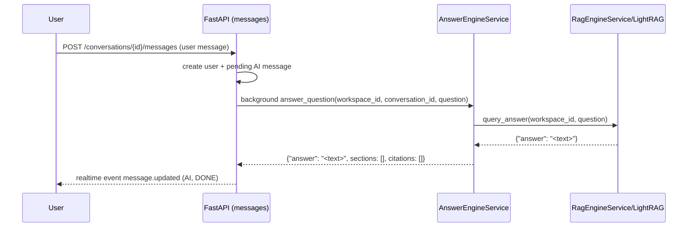

# Implement: Phase 9.1 – Revert answer engine citations

## 1. Summary
- Scope: server, Phase 9.1.
- Removed the custom JSON-based answer pipeline and source attribution logic from `AnswerEngineService`.
- Chat answers are now generated directly by LightRAG (`aquery_llm` via `RagEngineService.query_answer`) as in the original Phase 9 design.
- Server no longer computes `sections` or `citations`; the keys are kept in the response but always empty so the client contract does not change.

## 2. Related spec / design
- Requirements:
  - `docs/requirements/requirements-phase-9.md`
  - `docs/requirements/requirements-phase-9.1.md` (now partially superseded for citations)
- Design:
  - `docs/design/phase-9-design.md`
  - `docs/design/phase-9.1-design.md` – citation mapping is effectively disabled on the server side.

## 3. Files touched
- `server/app/services/answer_engine.py`
  - Replaced the Phase 9.1 implementation (LightRAG retrieval + separate LLM + SEG-based sections/citations) with a thin wrapper around `RagEngineService.query_answer`.
  - New behavior:
    - On success: returns `{"answer": <text>, "sections": [], "citations": [], "llm_usage": None}`.
    - On failure: logs the error and returns a Vietnamese fallback message with the same keys.
- `server/app/api/routes/messages.py`
  - No behavioral change; background worker now simply forwards `answer`, `sections`, `citations`, `llm_usage` from `AnswerEngineService`.
  - Existing helper functions for legacy citation building remain but are unused.

## 4. API changes
- HTTP response shape for `POST /api/conversations/{conversation_id}/messages` is unchanged.
- `metadata.sections` and `metadata.citations` for AI messages will now be omitted (because the lists are empty), so the client should not expect any citation bubbles in Phase 9.1.

## 5. Sequence / flow

## 6. Notes / TODO
- Citations / explainable RAG are temporarily disabled on the server.
- DB artefacts của Phase 9.1 đã được dọn:
  - Xóa table `rag_chunks_mapping` khỏi `server/app/db/models.py` và các hàm repo liên quan (`upsert_chunk_mappings`, `delete_chunk_mappings_for_document`, `get_chunk_mappings_by_chunk_ids`).
  - `JobsIngestService` không còn ghi mapping nào nữa – chỉ ingest vào LightRAG và cập nhật `rag_documents`.
- Alembic migration `7e4af545d2c1_phase_9_1_rag_chunks_mapping.py` vẫn được giữ nguyên để history không bị gãy, nhưng dùng `CREATE TABLE IF NOT EXISTS` / `DROP TABLE IF EXISTS` nên không gây lỗi trên DB mới hay cũ.
- If we redesign citations in a future phase, we should:
  - Start from LightRAG-native retrieval data and keep LightRAG as the source of truth for answer quality.
  - Avoid extra full-text DB scans that can hurt precision and performance.
