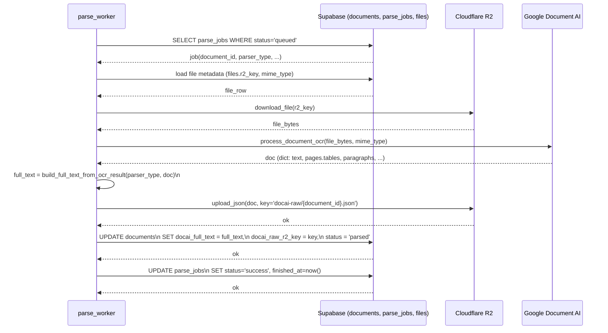

# Implement: DocAI layout-aware full_text builder

## 1. Summary
- Mục tiêu: cải thiện `docai_full_text` để giữ cấu trúc tài liệu (đặc biệt bảng) tốt hơn bằng cách tận dụng layout từ Google Document AI thay vì chỉ dùng `Document.text`.
- Scope: server (parser pipeline, services), Phase 2 (OCR) + cập nhật nhẹ design/requirements để khớp implementation.

## 2. Related spec / design
- Requirements:
  - `docs/requirements/requirements-phase-2.md` – phần Document AI & parser pipeline (mục 2, 3, 6).
- Design:
  - `docs/design/phase-2-design.md` – mô tả chi tiết `ParserPipelineService.process_single_job`.
  - `docs/design/architecture-overview.md` – đoạn sequence “Phase 2: OCR worker”.

## 3. Files touched
- `server/app/services/ocr_text_builder.py` – thêm module mới xây dựng `full_text` từ kết quả OCR, có phân nhánh theo `parser_type` và builder riêng cho Google Document AI (sử dụng `pages.tables`, `paragraphs`, `layout.text_anchor` để rebuild text, render bảng bằng các dòng với cột phân tách bằng `" | "`).
- `server/app/services/parser_pipeline.py` – thay vì dùng trực tiếp `doc["text"]`, lấy `parser_type` từ `parse_jobs` và gọi `build_full_text_from_ocr_result(parser_type, doc)` để sinh `full_text`; nếu `full_text` rỗng thì coi là lỗi.
- `docs/requirements/requirements-phase-2.md` – cập nhật mô tả để phản ánh việc Phase 2 hiện đã dùng layout cơ bản của Document AI để build `docai_full_text`, và ghi rõ behavior theo `parser_type`.
- `docs/design/phase-2-design.md` – chỉnh flow `process_single_job` để dùng helper `build_full_text_from_ocr_result` thay cho `result["text"]`, mô tả sơ lược chiến lược rebuild layout (tables/paragraphs).
- `docs/design/architecture-overview.md` – cập nhật sequence Phase 2: OCR worker để hiển thị bước `build_full_text_from_ocr_result(parser_type, doc)` trước khi lưu `documents.docai_full_text`.

## 4. API changes
- Không thay đổi API HTTP nào.
- Thay đổi chỉ ở internal behavior:
  - `documents.docai_full_text` giờ là text đã được rebuild dựa trên layout của Document AI (tables/paragraphs) thay vì copy thẳng `Document.text`.
  - Các API / worker downstream vẫn đọc cùng một trường (`docai_full_text`) và không cần đổi schema.

## 5. Sequence / flow

## 6. Notes / TODO
- Hiện tại builder layout-aware mới support `parser_type = 'gcp_docai'`; các parser/engine OCR khác trong tương lai sẽ fallback về `doc["text"]` trừ khi bổ sung builder riêng.
- Cách render bảng dùng separator `" | "` giữa các cell để dễ đọc trong HTML (client đang dùng `whitespace-pre-wrap`); nếu sau này cần align kiểu fixed-width có thể thay đổi chiến lược join ở `ocr_text_builder._render_table_row`.
- Chưa có test tự động cho `ocr_text_builder` – khi có hạ tầng test và sample JSON từ Document AI, nên bổ sung unit test với 1–2 ví dụ bảng/hóa đơn để đảm bảo không bị regress về layout.
