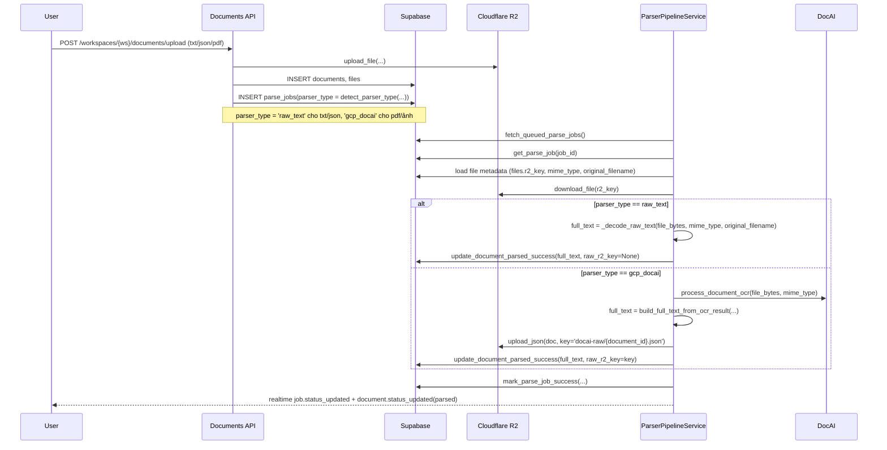

# Implement: Phase 10 – Non-OCR Direct Text/JSON Ingest

## 1. Summary
- Mục tiêu: cho phép các file đã là text/JSON (không cần OCR) đi qua pipeline parse/ingest hiện tại mà **bỏ qua Document AI**, nhưng vẫn sử dụng `docai_full_text` làm nguồn cho RAG.
- Scope: server (API upload, repositories, parser pipeline), Phase 10 theo spec/design mới; không thay đổi client hoặc schema DB.

## 2. Related spec / design
- Requirements:
  - `docs/requirements/requirements-phase-10.md` – đặc tả Phase 10 non-OCR documents.
- Design:
  - `docs/design/phase-10-design.md` – tech design chi tiết cho parser_type `raw_text` và branch trong ParserPipelineService.

## 3. Files touched
- `server/app/core/constants.py` – thêm constant `PARSER_TYPE_RAW_TEXT = "raw_text"` bên cạnh `PARSER_TYPE_GCP_DOCAI`.
- `server/app/db/repositories.py` – mở rộng `create_parse_job` để nhận arg `parser_type: str | None = None`, default về `PARSER_TYPE_GCP_DOCAI` để giữ nguyên behavior cũ.
- `server/app/api/routes/documents.py` – thêm helper `_detect_parser_type(original_filename, mime_type)`:
  - Nếu extension hoặc mime thuộc nhóm text/JSON (`.txt/.md/.markdown/.json/.csv/.tsv` hoặc `text/plain`, `application/json`, `text/markdown`, `text/csv`, `text/tab-separated-values`) → trả `PARSER_TYPE_RAW_TEXT`.
  - Ngược lại → `PARSER_TYPE_GCP_DOCAI`.
  - Khi tạo parse_job, truyền `parser_type` này vào `repo.create_parse_job`.
- `server/app/services/parser_pipeline.py`:
  - Import thêm `PARSER_TYPE_GCP_DOCAI`, `PARSER_TYPE_RAW_TEXT`.
  - Trong `process_single_job`:
    - Sau khi load `file_row`, đọc `r2_key`, `mime_type`, `original_filename` và download file từ R2.
    - Chuẩn hóa `parser_type` từ job (`normalized_parser_type = (parser_type or "").strip() or PARSER_TYPE_GCP_DOCAI`).
    - Nếu `normalized_parser_type == PARSER_TYPE_RAW_TEXT`:
      - Gọi `_decode_raw_text(file_bytes, mime_type, original_filename)` để decode UTF-8 (`errors="ignore"`) và `strip`.
      - Không gọi Document AI, không upload JSON raw.
    - Ngược lại (`gcp_docai`):
      - Gọi `self._docai_client.process_document_ocr(...)`, dùng `build_full_text_from_ocr_result(...)` để build `full_text`.
      - Upload JSON Document AI lên R2 (`docai-raw/{document_id}.json`) và set `raw_key` tương ứng.
    - Gọi `repo.update_document_parsed_success(..., full_text, raw_r2_key=raw_key or None)` và `mark_parse_job_success`.
    - Logging parse_job success bổ sung `parser_type` trong `extra`.
  - Thêm helper `_decode_raw_text(...)` ở cuối file để giải mã raw text đơn giản, không thay đổi nội dung JSON/CSV ngoài việc strip.
- `docs/implement/implement-2025-12-14-docai-layout-aware-full-text.md` – không chỉnh (giữ log Phase 2 layout-aware riêng).

## 4. API changes
- Không thay đổi route hoặc response schema.
- Thay đổi behavior nội bộ của `POST /api/workspaces/{workspace_id}/documents/upload`:
  - Với file text/JSON (theo rules ở `_detect_parser_type`), `parse_jobs.parser_type` sẽ là `"raw_text"` → parse worker bỏ qua Document AI.
  - Với các file còn lại (PDF, hình, DOCX, …) parser_type vẫn `"gcp_docai"` → behavior y như cũ.

## 5. Sequence / flow

## 6. Notes / TODO
- Hiện tại danh sách mime/extension cho `raw_text` là hard-code trong `_detect_parser_type`; nếu cần linh hoạt theo môi trường, có thể đưa vào config/env như `NON_OCR_MIME_TYPES`.
- `_decode_raw_text` đang giả định UTF-8; nếu sau này cần support encoding khác (ví dụ Windows-1258) có thể thêm detection nhẹ hoặc config per-workspace.
- Ingest worker và raw-text viewer không cần chỉnh; cả OCR documents và raw-text documents đều dùng `docai_full_text` làm source text, nên behavior downstream vẫn thống nhất. 
