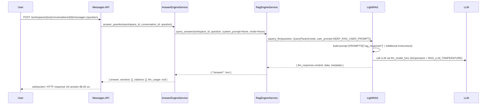

# Implement: RAG Deep Answers & Prompt Tuning (No New Phase)

## 1. Summary
- Mục tiêu: làm cho câu trả lời của LLM trong pipeline RAG chi tiết hơn, có phân tích/insight và gợi ý câu hỏi mở, đồng thời giữ nhiệt độ thấp để bám sát tài liệu.
- Scope: tinh chỉnh LightRAG wrapper (`RagEngineService`) và config RAG; không thay đổi API/schema hoặc client.

## 2. Related spec / design
- Phase 3 / 9 (RAG & LightRAG integration):
  - `docs/requirements/requirements-phase-3.md` (RAG-Anything → LightRAG).
  - `docs/design/phase-9-design.md` – thiết kế LightRAG wrapper và query flow.
- Phase 8 (Answer orchestrator – làm nền cho việc chọn model/temperature thấp):
  - `docs/design/phase-8-design.md`
  - `docs/implement/implement-2025-12-07-phase-8-answer-engine-and-retrieval.md`

## 3. Files touched
- `server/app/core/config.py`
  - Mở rộng `RagSettings` với field mới:
    - `llm_temperature: float = 0.4`
  - Ý nghĩa:
    - Cho phép cấu hình nhiệt độ LLM dùng trong LightRAG qua env `RAG_LLM_TEMPERATURE`.
    - Default 0.4 để câu trả lời vẫn tương đối ổn định, nhưng mở rộng biểu đạt một chút trong phạm vi context.
- `server/app/services/rag_engine.py`
  - Thêm hằng:
    - `DEEP_RAG_USER_PROMPT`: chuỗi hướng dẫn bổ sung cho LightRAG, yêu cầu:
      - Trả lời chi tiết, từng bước, chỉ dựa trên context.
      - Thêm 1–3 “insights” (nhận xét/rủi ro/implication) ngắn.
      - Thêm mục “Follow-up questions” với 2–3 câu hỏi gợi ý, đặt **trước** phần `### References` để không xung đột với prompt gốc của LightRAG.
  - Trong `_get_lightrag_instance(...)`:
    - Đọc `llm_temperature` từ `self.settings.llm_temperature` (fallback 0.2 nếu thiếu).
    - Trong `llm_model_func(...)`:
      - Gọi `kwargs.setdefault("temperature", llm_temperature)` trước khi gọi `openai_complete_if_cache(...)`.
      - Kết quả: mọi call LLM nội bộ của LightRAG (retrieval/summary/query) đều dùng nhiệt độ thấp mặc định, trừ khi LightRAG override.
  - Trong `query_answer(...)`:
    - Sau khi tạo `param = QueryParam(mode=query_mode)`:
      - Set `param.user_prompt = DEEP_RAG_USER_PROMPT`.
    - Giữ nguyên call:
      - `raw = await lightrag.aquery_llm(question.strip(), param=param, system_prompt=system_prompt)`
    - Tức là:
      - System prompt gốc của LightRAG (`PROMPTS["rag_response"]`) vẫn được dùng.
      - `DEEP_RAG_USER_PROMPT` được inject vào phần “Additional Instructions: {user_prompt}”.

## 4. API changes
- Không thay đổi route, request/response schema.
- Behavior thay đổi ở tầng RAG nội bộ:
  - Câu trả lời sẽ có xu hướng:
    - Chi tiết hơn, có phân tích (insights).
    - Có thêm phần gợi ý câu hỏi tiếp theo (trước `### References`).
  - Nhiệt độ LLM trong LightRAG giảm xuống giá trị cấu hình (`RAG_LLM_TEMPERATURE`, mặc định 0.2).

## 5. Sequence / flow (high-level)

## 6. Notes / TODO
- Nếu về sau cần mode “ngắn gọn” vs “phân tích sâu”, có thể:
  - Thêm flag (vd `answer_mode`) ở server/client để chọn `user_prompt` khác nhau.
  - Hoặc cho phép override `DEEP_RAG_USER_PROMPT` qua config.
- Hiện tại `llm_temperature` cho LightRAG tách biệt với `AnswerSettings.temperature` (Phase 8); nếu sau này bật lại Answer Orchestrator riêng, cần phân biệt rõ:
  - `RagSettings.llm_temperature` → LLM bên trong LightRAG.
  - `AnswerSettings.temperature` → LLM orchestrator ngoài (nếu dùng).
